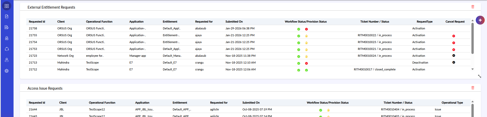
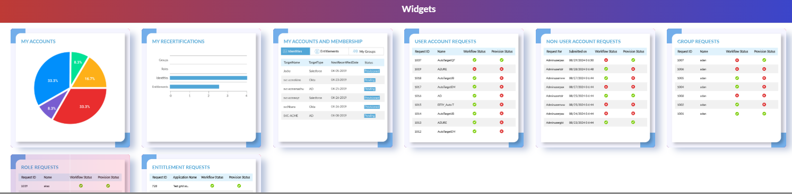
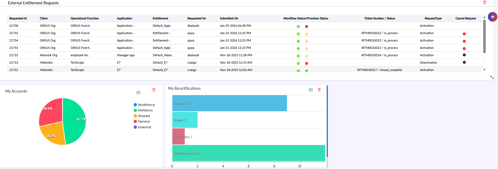
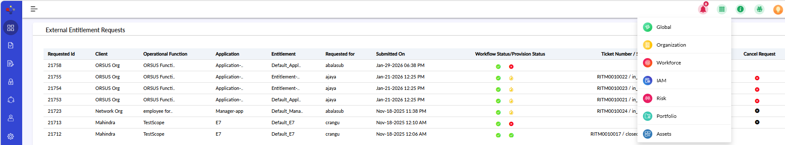

# Accessing Organization Module

## EBIS (Global) Dashboard

- To customize the Dashboard, follow the below steps:
- Click the “+” button in the top-right corner of the dashboard.
- A list of available widgets will appear.
- Select the widget(s) you want to add to your dashboard.
- The selected widgets will be added automatically.
- Drag and position the widgets to arrange and customize your dashboard layout.

{width=93%}

{width=93%}

{width=90%}

## Accessing the Platform – Flow (continued)

- Access the ORSUS Portal
- Use the login credentials provided by your Organization.
- Enter your username and password to access the Connect Portal.
- This is where you can raise requests, incidents, and track tasks.

- Connect via ORSUS
- Once logged in, you will see the ORSUS interface.
- Select Organization Module from the Modules dropdown list.

{width=95%}
