# Enterprise Business Integration Solutions (EBIS) Training (Organization module)

Simplified, Unified and Intuitive Console to Streamline IT Business Processes

## Objectives

**Introduction**

- Understand the Organization Module's purpose and its role as the foundational setup for FSM, Workforce, and Assets

**Accessing the Platform**

- Log in and navigate to the Organization Module using the correct environment.

**Prerequisites**

- Identify key configurations required before using the module, including tenant setup, authentication, and role assignments

**Performing Core Tasks**

- Create and manage organizations, hierarchies, locations, contracts, and intellectual property information.

**Administration Tab**

- Configure email templates, domain management, grid schema, and dropdown customizations.

**Dependencies**

- Understand how Organization Module data supports FSM, Workforce, and Asset modules

## What is EBIS

- ISSQUARED EBIS is an enterprise platform that centralizes and integrates core business operations such as Human Resources, Projects, Assets, Inventory, and Organizational data into a single unified system.

- Automates repetitive operational tasks.
- Manages employees, roles, onboarding, and workforce data.
- Tracks projects, portfolios, and performance.
- Manages assets, inventory, and operational records.
- Provides live operational insights across departments.
- Enables secure information sharing across teams.
- Supports role-based access and data governance.
- Integrates workforce and organizational data with other solutions

## Accessing the Platform – Prerequisites

- Before accessing EBIS, ensure all required configurations and user access setup activities are completed successfully. Users must have valid login credentials and appropriate permissions assigned by the administrator.

## Accessing the Platform – Flow

- Access the ORSUS Portal
- Use the login credentials provided by your Organization.
- Enter your username and password to access the EBIS Portal.

{width=44%}

- Connect via ORSUS
- Once logged in, you will see the ORSUS interface.
- Select Organization Module from the Modules dropdown list.

{width=24%}

{width=33%}

# Accessing Organization Module

## EBIS (Global) Dashboard

- To customize the Dashboard, follow the below steps:
- Click the “+” button in the top-right corner of the dashboard.
- A list of available widgets will appear.
- Select the widget(s) you want to add to your dashboard.
- The selected widgets will be added automatically.
- Drag and position the widgets to arrange and customize your dashboard layout.

{width=60%}

{width=59%}

{width=45%}

## Accessing the Platform – Flow (continued)

- Access the ORSUS Portal
- Use the login credentials provided by your Organization.
- Enter your username and password to access the Connect Portal.
- This is where you can raise requests, incidents, and track tasks.

- Connect via ORSUS
- Once logged in, you will see the ORSUS interface.
- Select Organization Module from the Modules dropdown list.

{width=70%}

# Organization – My Organizations

## Organization – My Organizations

- Navigate to My Organizations.
- To access the My Organizations module, open the main navigation menu from the left panel.
- Navigate to Organization.
- Select My Organizations from the submenu.
- The My Organizations screen displays the list of all configured organization records within the platform

{width=92%}

## Organization – My Organizations – Create Organization

- To create a new organization:
- Click the Create icon from the top toolbar.
- In the Basic Information tab, enter the required organization details such as Organization Name, Parent Organization, Website, Resolver Group, Phone Numbers, and Number of Locations.
- Select the Validate Domains option if domain validation is required.
- Select the Publicly Traded checkbox if the organization is publicly listed.

{width=87%}

{width=94%}

## Organization – My Organizations – Create Organization (continued)

- Click the Incorporation Details tab.
- Enter incorporation details such as Incorporation Name, Incorporation Type, Incorporation Status, Country, State, Incorporation Number, Incorporation Date, Fees, and Costs.
- Select whether the organization is incorporated internally or through a consultancy.
- Enter consultancy details if applicable.

- Click Save to create the organization record.
- Click Save & New to save the current record and create another organization.

{width=68%}

## Organization – My Organizations – Create Organization (continued 3)

- Under the License Details tab, review or update:
 - License Name
 - License Type
 - License Status
- Use the Add New option to create additional license records if required.
- In the Other Details section, update the required custom fields and organization-specific information.
- Modify password or confidential fields carefully to maintain data accuracy and security.

{width=68%}

- Trade Listing tab.
- Update the required trade-related details and listing information.
- Review the entered values carefully.
- Click Save / Update to apply the changes.

{width=68%}

## Organization – My Organizations – Create Organization (continued 4)

- Other Details tab.
- Update the required custom fields such as:
 - Name fields
 - Identification or Roll Number fields
 - Text fields
 - Date fields
 - Password and confirmation fields
- Ensure all required information is entered correctly.
- Verify password confirmation fields wherever applicable.
- Click Save / Update to apply the changes.

{width=60%}

- Documents tab.
- Upload, replace, or manage the required organization documents.
- Verify that the correct files are attached.
- Click Save / Update to apply the changes.

{width=60%}

{width=60%}

## Organization – My Organizations – Create Organization (continued 5)

- Click the option to add or select SMTP domains.
- In the Select SMTP Domain Name window, choose the required SMTP domain from the available list.
- Use the search or filter option to locate a specific domain if required.
- Select the checkbox corresponding to the required SMTP domain.
- Click OK to associate the selected SMTP domain with the organization.
- Click Save / Update to apply the changes.

{width=81%}

## My Organizations – Create Organization – Settings Features

- The Settings options in Create Organization allow administrators to prepare and configure additional organization-related controls before or after saving the organization record.

- Key Settings Features
- List Values
- Custom Fields
- Administrator Responsibilities
- Configure predefined dropdown values.
- Define additional organization fields
- Prepare security and access configurations
- Maintain organization-specific administrative settings.

{width=70%}

## My Organizations – Create Organization – List Values

- The List Values option is used to manage predefined dropdown values used across organization forms and fields.

- To configure list values during organization setup, open the Settings menu.
- Select List Values.
- In the List Values screen, locate the required category or field.
- Click Add New to create a new list value.
- Enter the required value details.
- Modify existing values if required.
- Verify the configured information.
- Click Save / Update.

{width=91%}

## My Organizations – Create Organization – Custom Fields

- Settings – Custom Fields
- The Custom Fields option is used to create additional fields dynamically for the organization module.
- To create a custom field, open the Settings menu. Select Custom Fields.
- Click Add New.
- Enter the Field Name and Label Name.
- Select the required Field Type.
- Enter field option values if the selected field type requires predefined values.
- Select the required Section and Class.
- Enable the Required option if the field must be mandatory.
- Click Save.

{width=61%}

## My Organizations – Edit Organization – Settings Features

- The Settings options in Create Organization allow administrators to prepare and configure additional organization-related controls before or after saving the organization record.

- Key Settings Features
- List Values
- Custom Fields
- Record Level Security
- Important Note
- Some Settings features become fully functional only after the organization record is saved successfully.
- Administrator Responsibilities
- Configure predefined dropdown values.
- Define additional organization fields
- Prepare security and access configurations
- Maintain organization-specific administrative settings.

{width=70%}

## My Organizations – Organization – My Organizations

- To create any additional tab for a particular child category of basic or information or Incorporation Details sections (in this case, it’s the License Details tab):
- Click Add New to open the Create License Details screen.
- Enter the required information such as:
 - Organization Name
 - License Name
 - License Type
 - License Status, etc.
- Click Save to create the license record.
- Click Save & New to save the current record and immediately create another license entry if required.

{width=68%}

{width=68%}

## Organization – My Organizations (continued)

**Edit/Modify My Organizations Details**
- Navigate to Organization > My Organizations.
- From the organizations list, select the required organization record.
- Click the Edit/Modify option from the top toolbar.
- In the edit screen, update the required fields under the Basic Information.
- Modify details such as: Organization Name, Website, Phone Numbers, Parent Organization, Resolver Group, Number of Locations, Publicly Traded option.
- Use the Validate Domains option to verify whether the organization’s domain information is valid.
- Enable the Publicly Traded checkbox if the organization is listed on a public stock exchange.
- Click Save / Update to apply the changes.

{width=79%}

{width=37%}

{width=43%}

## Organization – My Organizations (continued 3)

- In the edit screen, update the required fields under the Incorporation Details.
- Modify details such as: Incorporation Type, Incorporation Country, Incorporation Number, Incorporation Fees, Incorporation Status, Incorporation Date, Consultancy Information.
- Use the Validate Domains option to verify whether the organization’s domain information is valid.
- Enable the Publicly Traded checkbox if the organization is listed on a public stock exchange.
- Click Save / Update to apply the changes.

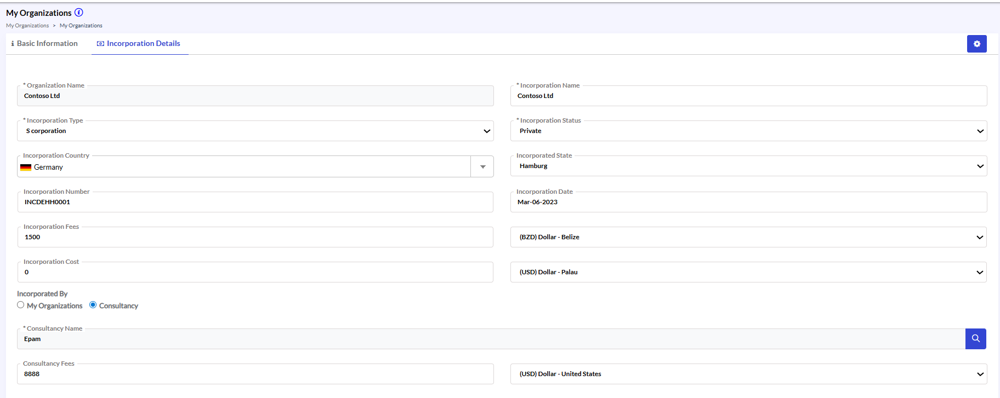{width=74%}

## Organization – My Organizations (continued 4)

- Click the option to add a new document.
- In the Documents screen, enter the required information such as:
 - Document Title
 - Document Version Number
 - Document Type
 - Description
- Enable the Template Doc Type option if the document is intended to be used as a template document type.
- Click Choose File to upload the required document from the local system.
- Click Save to create the document record.
- Click Save & New to save the current document and immediately upload another document if required.

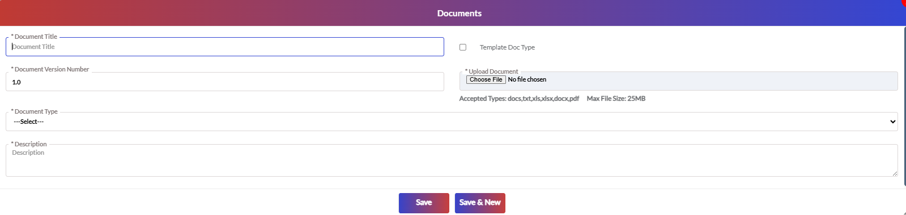{width=71%}

## Organization – My Organizations (continued 5)

- Click the option to add a new trade listing record.
- In the Trade Listing screen, enter the required information such as:
 - Listed In Exchange
 - Trade Code
 - Listing Date
 - De-Listing Date
- Verify all entered information carefully.
- Click Save to create the trade listing record.
- Click Save & New to save the current record and immediately create another trade listing entry if required.

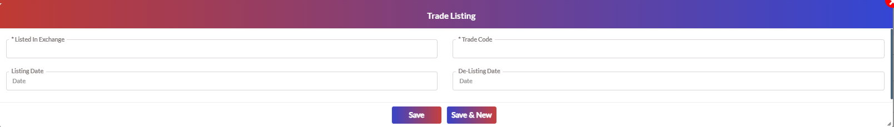{width=69%}

## My Organizations – Edit Organization

**Edit/Modify My Organizations Details**
- Navigate to Organization > My Organizations.
- From the organizations list, select the required organization record.
- Click the Edit/Modify option from the top toolbar.
- In the edit screen, update the required fields under the Basic Information.
- Modify details such as: Organization Name, Website, Phone Numbers, Parent Organization, Resolver Group, Number of Locations, Publicly Traded option.
- Click Save / Update to apply the changes.

{width=79%}

{width=37%}

{width=43%}

## My Organizations – Edit Organization – List Values

- The List Values option allows administrators to update and maintain predefined dropdown values associated with organization records.

- To modify existing list values:
- Open the Settings menu from the organization screen. Select List Values.
- Locate the required list category.
- Select the existing value to modify or click Add New to create additional values.
- Update the required information.
- Click Save / Update.

{width=86%}

## My Organizations – Edit Organization – Custom Fields

- The Custom Fields option is used to manage additional organization fields and update existing field configurations.

- To update custom fields for organizations:
- Open the Settings menu.
- Select Custom Fields.
- Locate the required custom field from the list.
- Click Edit to modify the field configuration.
- Update the required field details such as Label Name, Field Type, Options, or Section Assignment.
- Verify the updated configuration.
- Click Save.

## My Organizations – Edit Organization – Record Level Security

- The Record Level Security option allows administrators to manage organization access permissions for users and application roles.

- To update organization access permissions, open the Settings menu.
- Select Record Level Security.
- Navigate to the Roles or Users tab.
- Search and select the required role or user.
- Modify the required access permissions.
- Enable or disable View, Edit, Delete, or Grant Access permissions as required.
- Verify the permission configuration.
- Click Set Permissions / Save.

{width=61%}

{width=60%}

## My Organizations – Clone Organization

- To duplicate an existing organization record:
- Select the required organization from the list.
- Click the Clone icon from the top toolbar.
- In the clone screen, modify the copied organization details as required.
- Verify the information before saving.
- Click Save / Create.

{width=65%}

## My Organizations – Delete Organization

- To remove an organization record:
- Select the required organization from the list.
- Click the Delete icon from the top toolbar.
- In the confirmation message, verify the selected organization details.
- Click Confirm / Delete to permanently remove the organization.

{width=92%}

## My Organizations – View Organization

- To view organization details, select the required organization record from the list.
- Click the View icon from the top toolbar. The system displays all configured information in read-only mode, including:
**Basic Information**
**Incorporation Details**
**License Details**
 - Trade Listing
**Other Details**
 - Documents
 - SMTP Domains
- Use the tabs to navigate between sections.

## My Organizations – Refresh Organization List

- To reload the organization records displayed on the screen:
- Click the Refresh icon from the top toolbar.
- The system refreshes the organization list and displays the latest available records.

{width=93%}

# Organization – Organizational Relationship

## Organization – Organizational Relationship

- This section is used to create and manage relationships between organizations such as customers, subsidiaries, vendors, partners, or service providers. It helps maintain business associations, contract relationships, and organizational hierarchy information.

{width=55%}

## Organizational Relationship – Edit/Modify Relationship Details

- Navigate to Organization > Organizational Relationship.
- Select the required relationship record from the list view.
- Open the selected record in edit mode.
- Update the required fields such as Relationship Type, Contract Information, Relationship Name, Relationship Description, or Notes.
- Verify the updated information for accuracy.
- Click Save / Update to apply the changes.

## Organizational Relationship – Common Toolbar Actions

- The Organizational Relationship section supports common toolbar actions similar to the My Organizations module.
- Clone – Creates a duplicate copy of the selected relationship record for quicker record creation.
- Delete – Removes the selected organizational relationship record from the system.
- View – Opens the selected relationship record in read-only mode for review purposes.
- Refresh – Reloads and displays the latest available records in the list view.

{width=90%}

{width=90%}

# Organization – Intellectual Property

## Organization – Intellectual Property

- This section allows administrators to create and manage intellectual property records such as copyrights, patents, and trademarks. It helps track ownership details, application information, publication dates, renewals, assigned organizations, and related costs.

{width=72%}

## Intellectual Property – Create New Record

- To Create New IP Record:
- Select the required Intellectual Property Type such as Copyright, Patent, or Trademark.
- Enter the IP Title and Parent Name details. Select the Applied Country where the intellectual property is registered or applied.
- Enter the Application Date, Publication Date, Application Number, and Expiry Date details.
- Provide the Renewal Period and configure renewal-related information if applicable.
- Enter Renewal Cost and select the required currency value.
- Specify the notification frequency and notification email details for renewal reminders.
- Select the Current Assignee Organization and Original Assignee Organization if applicable.
- Click Save to create the intellectual property record.
- Click Save & New to immediately create another IP entry if required.

{width=62%}

## Intellectual Property – Edit Intellectual Property Details

- To edit Intellectual Property Details:
- Navigate to Organization > Intellectual Property.
- Select the required intellectual property record from the list view.
- Click the Edit icon.
- Update the required details such as Intellectual Property Type, IP Title, Applied Country, Publication Date, Expiry Date, Renewal Information, Notification Details, or Assignee Organization details.
- Verify the updated information carefully.
- Click Save / Update to apply the changes.

{width=59%}

{width=29%}

{width=31%}

{width=61%}

## Intellectual Property – Edit Intellectual Property Details (continued)

**Documents Tab**
- Use the Create New option to add a new document record. Upload or manage intellectual property-related supporting documents such as copyright certificates, trademark files, patent documents, agreements, or legal attachments. Click Save / Update to apply the changes.

{width=53%}

**Costs Tab**
- Use the Create New option to add a new cost record associated with the intellectual property. Maintain financial information such as Invoice Number, Invoice Date, PO Number, Payment Due Date, renewal charges, legal expenses, or maintenance costs. Click Save / Update to apply the changes.

{width=58%}

{width=58%}

## Intellectual Property – Edit Intellectual Property Details (continued 3)

**Inventors Tab**
- Use the Create New option to associate inventor records with the intellectual property.
- Add or manage inventor-related information such as Organization Name and User Name.
- Click Save to apply the changes.

**Attorney Information Tab**
- Use the Create New option to add attorney or legal representative details associated with the intellectual property record.
- Maintain attorney-related information such as Attorney Title, Organization Name, Engagement Start Date, and Engagement End Date.
- Click Save / Update to apply the changes.

{width=62%}

{width=62%}

**Attorney Interactions Tab**
- Add or update details such as Conversation Date, Conversation Title, and Conversation Type.
- Maintain communication history, legal follow-ups, and interaction tracking information wherever applicable.
- Click Save to apply the changes.

{width=63%}

# Organization – My Locations

## Organization – My Locations

- The My Locations module is used to create, manage, and maintain organization location records within the platform. It allows administrators to configure location-specific information such as office locations, branches, facilities, addresses, contact details, and location hierarchy associated with organizations.

- To access the My Locations, open the main navigation menu from the left panel
- Navigate to My Locations.

{width=65%}

## Organization – My Locations – Create New Location

- Open the My Locations screen and create a new location record.
- Enter the required details such as Location Name and Organization Name.
- Provide contact details including Phone 1 & 2 information.
- Enter Address, address 2, and Address 3 details as required.
- Select the Country and State values and enter City and Zip details.
- Assign the Location Head if applicable.
- Enter the Location Email Address for communication purposes.
- Specify the Location Code or enable the auto-generated location code option if required.
- Enable the Head Quarters option if the location represents the organization’s primary headquarters.
- Upload a location image if applicable.
- Enter Latitude & Longitude values or use the Search Location option to identify the geographical location.
- Use the Notes section to capture additional information.
- Click Save or Save & New.

{width=55%}

{width=55%}

## Organization – My Locations – Create New Location (continued)

**Additional Information Tab**
- Navigate to the Additional Information tab under the Buildings section.
- Maintain additional building contact and address-related information such as Phone 1, Phone 2, address details, Country, State, City, and Zip information.
- Review all entered address and contact information carefully before saving.
- Click Save / Update to apply the changes.

{width=88%}

## Organization – My Locations – Create New Location (continued 3)

**Access Information Tab**
- Navigate to the Access Information tab.
- Maintain building access-related information and security access details wherever applicable.
- Update access configurations and related operational details based on business requirements.
- Review all entered information carefully before saving.
- Click Save / Update to apply the changes.

{width=74%}

## Organization – My Locations – Create New Location (continued 4)

**Other Information Tab**
- Navigate to the Other Information tab.
- Maintain additional building-specific operational or administrative information configured for the organization.
- Update the required custom or supplementary details as applicable.
- Review all entered information carefully before saving.
- Click Save / Update to apply the changes.

{width=89%}

## Organization – My Locations – Create New Location (continued 5)

**Documents Tab**
- Navigate to the Documents tab.
- Upload, replace, or manage building-related supporting documents and attachments.
- Verify that the correct files are attached before submission.
- Click Save / Update to apply the changes.

{width=89%}

## Organization – My Locations – Create New Location (continued 6)

- Navigate to the Floors tab.
- Create and manage floor records associated with the selected building.
- Maintain floor-related information such as floor identification, numbering, and associated operational details.
- Review all entered floor information carefully before saving.
- Click Save / Update to apply the changes.

{width=85%}

## Organization – My Locations – Edit Location Details

- Select the required location record from the list view.
- Open the selected record in edit mode.
- Update the required details such as address information, contact details, location head, geo-location details, or organization information.
- Modify the location image or notes if required.
- Click Save / Update to apply the changes.

{width=77%}

## Organization – My Locations – Edit Buildings

- The Buildings section allows administrators to associate one or more building records with a specific organization location.
- Navigate to the Buildings section under the selected location record.
- Use the Create New option to add a new building record.
- Enter or update details such as Building Name, Building Number, and Primary Building information.
- Enable the Is Primary option for the main building associated with the location if applicable.
- Click Save / Save & New to apply the changes.

{width=64%}

{width=61%}

## Organization – My Locations – Edit Buildings (continued)

**Additional Information Tab**
- Navigate to the Additional Information tab under the Buildings section.
- Maintain additional building contact and address-related information such as Phone 1, Phone 2, address details, Country, State, City, and Zip information.
- Review all entered address and contact information carefully before saving.
- Click Save / Update to apply the changes.

{width=83%}

## My Locations – Edit Location Details – Buildings

**Access Information Tab**
- Navigate to the Access Information tab.
- Maintain building access-related information and security access details wherever applicable.
- Update access configurations and related operational details based on business requirements.
- Click Save / Update to apply the changes.

{width=85%}

## My Locations – Edit Location Details – Buildings (continued)

**Other Information Tab**
- Navigate to the Other Information tab.
- Maintain additional building-specific operational or administrative information configured for the organization.
- Update the required custom or supplementary details as applicable.
- Review all entered information carefully before saving.
- Click Save / Update to apply the changes.

{width=96%}

## My Locations – Edit Location Details – Buildings (continued 3)

**Documents Tab**
- Navigate to the Documents tab.
- Upload, replace, or manage building-related supporting documents and attachments.
- Verify that the correct files are attached before submission.
- Click Save / Update to apply the changes.

{width=91%}

## My Locations – Edit Location Details – Buildings (continued 4)

**Floors Tab**
- Navigate to the Floors tab. Create and manage floor records associated with the selected building. Maintain floor-related information such as floor identification, numbering, and associated operational details. Review all entered floor information carefully before saving. Click Save / Update to apply the changes.

{width=67%}

## My Locations – Buildings – Floors

- The Floors section allows administrators to create and manage floor-level information associated with a selected building. This section helps maintain floor identification details, floor type, workspace allocation, accessibility features, operational facilities, floor plans, and safety-related information.

- Select the required location and open the associated building record.
- Navigate to the Floors tab under the Buildings section.
- Create a new floor record for the selected building.
- Enter the required floor details such as:
 - Building Name, Floor Name, Floor Number
 - Building Floor Type
 - Total Area
 - Area Measurement Unit
 - Maximum Workspaces
 - Floor DL Email Address

{width=69%}

## My Locations – Buildings – Floors (continued)

- Configure the Floor Plan options based on the facilities available on the floor:
 - Data Center
 - Work/Office Spaces /Conference Rooms
 - Mail Stops /Warehouse
 - Configure the Floor Information options as applicable:
 - Fully Owned/Leased
 - Fully Occupied
- Click Save to create the floor record.

{width=84%}

# Organization – Contracts

## Organization – Contracts

- The Contracts module allows administrators to create, manage, and maintain contract records associated with organizations, vendors, customers, or business entities. This section helps maintain contract lifecycle information including contract duration, contract value, renewal terms, superseding contracts, extension rules, recipients, and supporting contract documents.

**Contracts – Manage Contract Records**

- Navigate to Contracts > Contracts.
- The Contracts list screen displays all available contract records along with important details such as:
 - Contract Name
 - Internal Contract Number
 - Contract Type
 - Contract Scope
 - My Organization Name
- Use the available search and filter options to locate the required contract record.

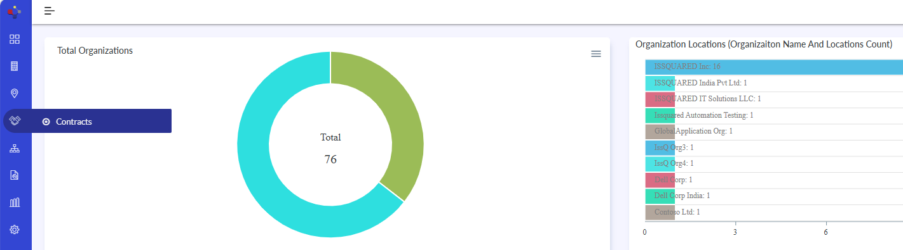{width=49%}

{width=68%}

## Organization – Contracts – Common Toolbar Actions

- Select the required contract record from the list.
- Use the available actions to:
 - Edit contract details
 - View contract information
 - Delete contract records
 - Refresh the list view

{width=68%}

## Organization – Contracts (continued)

- To create a new Contract:
- In the Contracts listing screen, click Create New from the top toolbar.
- The Create Contract screen is displayed.
- Enter the required contract information in the Basic Information section such as:
 - Contract Name
 - My Organizations
 - External Organization
 - Contract Type
 - Internal Contract Number

{width=59%}

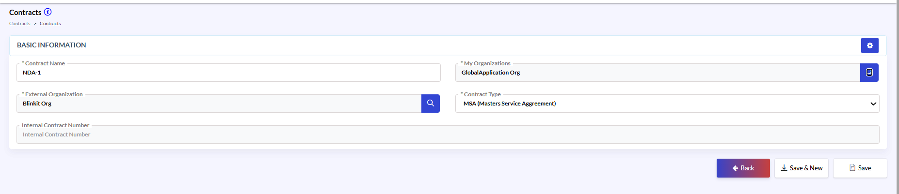{width=69%}

## Organization – Contracts (continued 3)

- After clicking Save, the remaining contract sections will appear as shown below. Configure these sections using the available tabs:
**Contract Details**
 - Information
**Other Information**
 - Request Recipients
 - Contract Document
- Review all entered details carefully.
- Click Save to create the contract record.

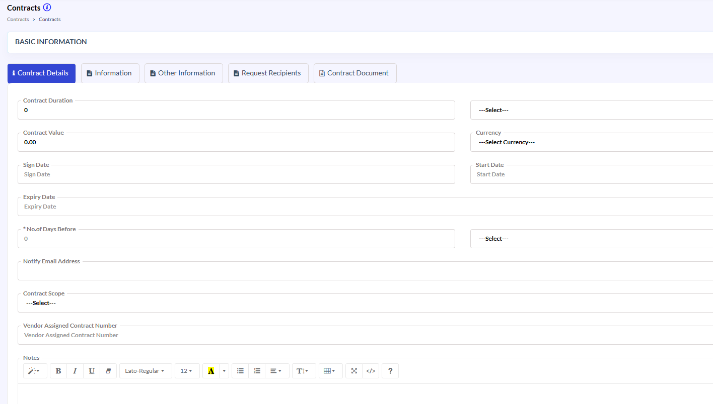{width=66%}

## Organization – Contracts (continued 4)

- Information Tab. The Parent Contract and Superseding Contract options are useful when:
- A contract replaces an older agreement
- Additional amendments are added.
- Contracts are renewed or renegotiated
- Review all configured relationships carefully before saving.
- Click Save / Update to apply the changes.

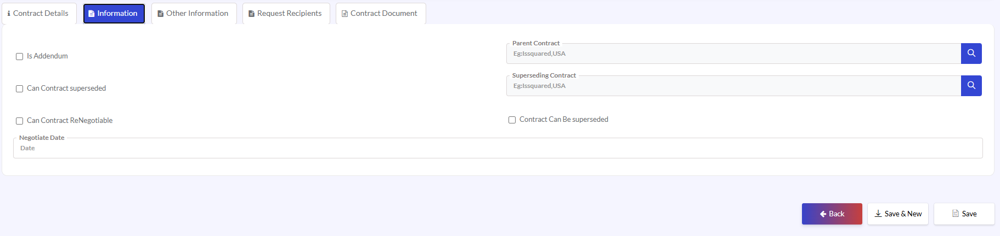{width=72%}

## Organization – Contracts (continued 5)

**Other Information Tab**
- This section helps organizations:
 - Manage renewal flexibility
 - Define termination rules
 - Configure financial penalties.
 - Maintain contract lifecycle governance.
- Review all configured information carefully before saving.
- Click Save / Update to apply the changes.

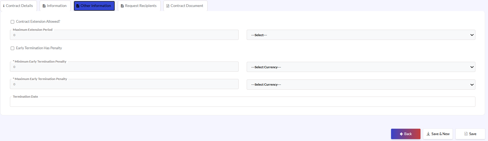{width=71%}

## Organization – Contracts (continued 6)

**Request Recipients Tab**
- Navigate to the Request Recipients tab.
- This section is used to maintain signer and recipient information associated with the contract approval or signing process.
- Users can:
 - Add recipient records.
 - Maintain signer organization details.
 - Track contract signing participants.
- The Request Recipients section helps organizations manage contract communication workflows and approval participants.
- Use the Create New option to add recipient records wherever required.
- Review all recipient information carefully before saving.
- Click Save / Update to apply the changes.

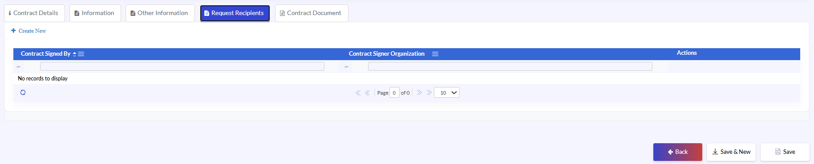{width=84%}

## Organization – Contracts (continued 7)

- To Configure Request Recipients
- Open the Request Recipients tab.
- Click the lookup icon beside Contract Signer Organization and select the appropriate organization.
- Click the lookup icon beside Contract Signed By and select the individual authorized to sign the contract.
- Optionally enter additional comments in the Notes section.
- Save the record.

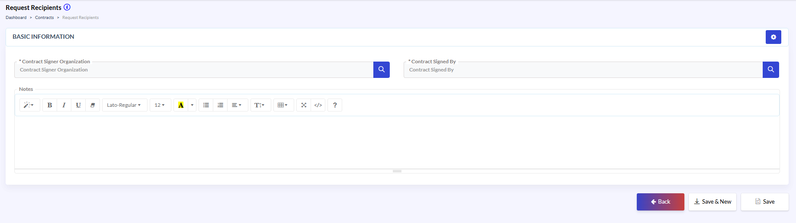{width=62%}

## Organization – Contracts (continued 8)

**Contract Document Tab**
- Navigate to the Contract Document tab.
- This section is used to maintain documents associated with the selected contract.
- Users can:
- Upload supporting contract documents.
- Maintain document version information.
- Track associated contract files.
- Store agreement-related attachments.
- The Contract Document section helps centralize all contract-related documentation within a single contract record.
- Use the Create New option to add document records wherever required.
- Review all document information carefully before saving.
- Click Save / Update to apply the changes.

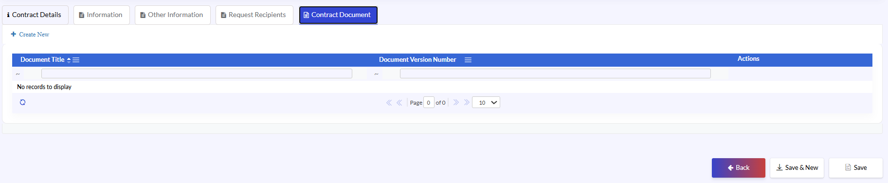{width=82%}

## Organization – Contracts (continued 9)

- To Upload a Contract Document:
- Open the Contract Document tab.
- Enter a Document Title.
- Specify the Document Version Number.
- Enter a brief Document Description.
- Click Choose File and select the contract document to upload.
- Optionally enter additional notes.
- Click Save to attach the document to the contract.

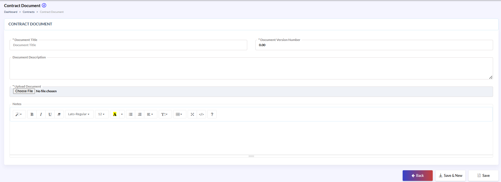{width=61%}

## Organization – Contracts (continued 10)

- Edit Contract
- The Edit Contract screen allows users to update existing contract information throughout the contract lifecycle.

- To Edit a Contract:
- Navigate to Contracts > Contracts.
- Select the required contract record.
- Click the Edit icon.
- Review the existing contract information across all tabs.
- Update contract details, notification settings, signer information, or supporting documents as required.
- Modify Notes where necessary.
- Click Save to apply the changes.

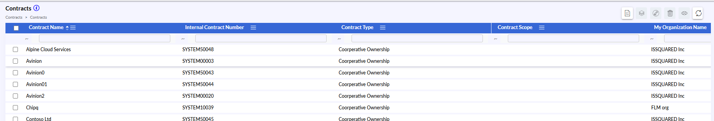{width=44%}

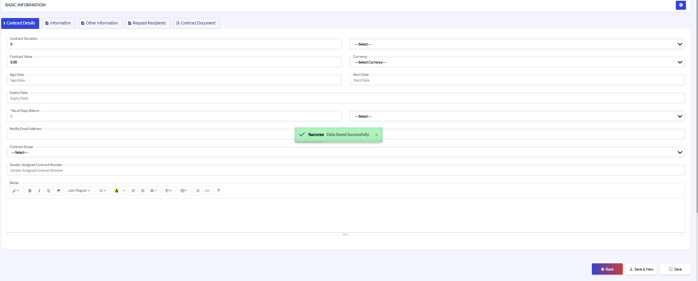{width=60%}

## Organization – Edit Contract

- Edit / Modify Contract. The Edit Contract screen is organized into multiple tabs to logically separate contract-related information and improve maintainability.
- To edit a contract:
- Navigate to Organization → Contracts.
- Locate the required contract from the Contracts listing screen.
- Select the required contract record.
- Open the contract in Edit mode.
- Update the required information in the available sections and tabs.
- Click Save / Update to apply the changes.

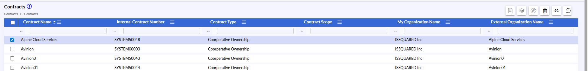{width=70%}

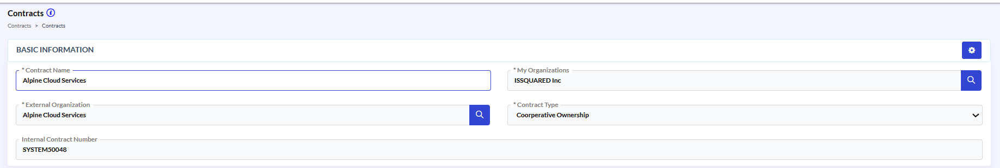{width=61%}

## Organization – Edit Contract (continued)

**To Edit Contract Details**
- Navigate to the Contract Details tab.
- Update the Contract Duration and duration unit if the contract term has changed.
- Modify the Contract Value or Currency as required.
- Update the Sign Date, Start Date, or Expiry Date if contract dates have been revised.
- Adjust the No. of Days Before value to change when expiration notifications are generated.
- Add or update the Notify Email Address to ensure reminders are sent to the appropriate recipients.
- Modify the Contract Scope if the coverage or purpose of the contract has changed.
- Update the Vendor Assigned Contract Number if a revised vendor reference is provided.
- Add or update information in the Notes section as needed.
- Click Save to apply the changes.

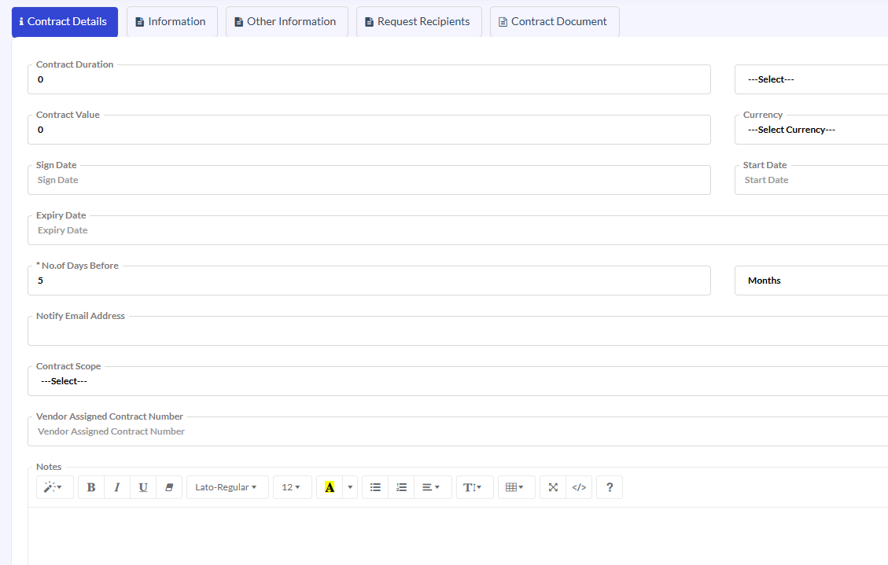{width=46%}

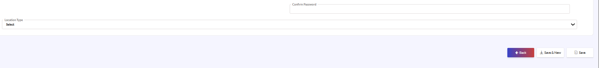{width=46%}

# Organization – External Organizations

## Organization – External Organizations

- The External Organizations module is used to create, manage, and maintain information related to third-party organizations, vendors, partners, subsidiaries, clients, and associated business entities.

- Once users navigate to External Organizations section, they can:
- Create new external organizations.
- Modify existing organization records.
- Maintain organization hierarchy and classifications.
- Manage contacts, documents, domains, entitlements, and operational information
- Track organization-related applications and issues.

{width=62%}

## Organization – External Organizations (continued)

- The External Organizations module is used to create, manage, and maintain information related to third-party organizations, vendors, partners, subsidiaries, clients, and associated business entities.

- Navigate to 
- Organization → External Organizations
- The system displays the External Organizations listing screen.

{width=56%}

- The listing screen displays all available external organization records in a searchable grid format.
- The grid includes:
- Organization Name
- Organization Generated ID
- Top Parent Status
- Number of Locations
- Website
- Activation State

{width=67%}

## Organization – External Organizations – Common Toolbar Actions

- The toolbar options such as:
 - Clone
 - Delete
 - View
 - Refresh
- have already been explained in the My Organization section and follow the same behavior throughout the application.
- Use these options to:
 - Duplicate existing records.
 - Remove records
 - Open records in read-only mode.
 - Reload the latest data.

{width=95%}

## Organization – External Organizations (continued 3)

- Create / Edit External Organization.
- Navigate to the External Organizations screen.
- To create a new organization record, open the organization creation screen.
- To modify an existing organization:
 - Select the required organization record from the listing screen.
 - Open the organization details screen.
- In the Organization Name field, enter or update the organization name.
- Select the appropriate Activation State.
- If the organization belongs to a parent organization:
 - Locate the Parent Organization field.
 - Search and select the required parent organization.

{width=55%}

{width=65%}

## Organization – External Organizations (continued 4)

- Enable the Top Parent option if the organization is the primary parent organization.
- Enter or update:
 - Website details
 - Resolver Group
 - Phone numbers
 - Service Catalogue ID
- Select organization classifications such as:
 - Market Tier
 - Organization Tier
 - Primary Vertical
 - Secondary Vertical
- Review the generated organization ID and domain validation settings.

{width=65%}

## Organization – External Organizations (continued 5)

**Additional Details**
- Navigate to the Additional Details tab.
- Select the appropriate Region.
- Enter or update the:
 - Number of Employees
 - District
 - Sub District
 - Number of Locations
- Review all entered details carefully.
- Click Save / Update to apply the changes.

{width=64%}

## Organization – External Organizations (continued 6)

**Other Details**
- Navigate to the Other Details tab.
- In the Base Technology Platform field:
 - Select the primary technology platform used by the organization.
- Enter the Annual IT Budget value.
 - Select the corresponding currency and financial category where applicable.
- Enter the organization’s Market Cap value.
 - Select the appropriate currency and classification.

{width=64%}

## Organization – External Organizations (continued 7)

- Enable the International Company option if the organization operates internationally.
- Enable the Security Clearance Required option if additional security validation is needed for engagements.
- Enter the required Trade Code information.
- Enter details related to:
 - Listed In Exchange
 - Outsourcing Affinity
 - Information Created Through
- Upload the organization image if required.
- Use the Notes section to enter any additional business remarks or references.
- Click Save / Update to apply the changes.

{width=67%}

## Organization – External Organizations (continued 8)

- Documents
- Navigate to the Documents tab.
- Click Create New to add a new document record.
- Enter or select:
 - Document Title
 - Document Version
 - Document Type
- Review template and inheritance details if applicable.
- Upload or associate the required document.
- Verify all document information carefully.
- Click Save / Update to apply the changes.

{width=67%}

## Organization – External Organizations (continued 9)

{width=67%}

- Operational Function
- Navigate to the Operational Function tab.
- Click Create New to add a new operational function.
- Enter or update:
 - Operational Function Name
 - Activation State
 - Operational Function Description
- Review all operational function details carefully.
- Click Save / Update to apply the changes.

{width=53%}

- SMTP Domains
- Navigate to the SMTP Domains tab.
- Click Add New to create a new SMTP domain entry.
- Enter the required SMTP domain name.
- Verify the domain information carefully.
- Click Save / Update to apply the changes.

## Organization – External Organizations (continued 10)

- Entitlements
- Navigate to the Entitlements tab.
- Add or update entitlement-related information as required.
- Review all entitlement configurations carefully.
- Click Save / Update to apply the changes.

{width=66%}

- Issues
- Navigate to the Issues tab.
- Review the available issue records.
- Add or update issue information where applicable.
- Verify:
 - Application Name
 - Business Description
 - Technical Description
- Review all issue details carefully.
- Click Save / Update to apply the changes.

{width=65%}

## Organization – External Organizations (continued 11)

**Application Documents**
- Navigate to the Application Documents tab.
- Review existing application document records.
- Add or associate new application documents where required.
- Verify:
 - Application Name
 - Organization
 - Document Name
- Review all entered information carefully.
- Click Save / Update to apply the changes.

{width=68%}

# Organization – External Locations

## Organization – External Locations

- Navigate to External Organizations → External Locations.
- Review the list of available external locations.
- Use the available filters to search by:
 - Location Name
 - Headquarters Status
 - Organization Name
- Select the required location record.
- Use the available actions to:
 - View location details
 - Edit existing records
 - Delete records if permitted

{width=62%}

{width=69%}

## Organization – External Locations (continued)

- Create / Edit External Location.
- The Create / Edit External Location screen is used to maintain detailed address, communication, and operational information for external organization locations.
- This screen also serves as the parent configuration layer for buildings associated with the location.

**Basic Information**
**Location Details**
- Enter the Location Name.
- Select the associated Organization Name.
- Enter:
 - Phone 1
 - Phone 2
 - Location Email Address
- Enable the Head Quarters option if the location is the organization’s headquarters.

{width=69%}

{width=43%}

## Organization – External Locations (continued 3)

{width=63%}

**Address Information**
- Enter:
 - Address Line 1.
 - Address Line 2.
 - Address Line 3.
- Select the Country.
- Select the appropriate State.
- Enter:
 - Other State (if applicable)
 - City
 - ZIP Code

**Operational Information**
- Enter the Location Head information.
- Enable Is Auto Generated Location Code? if automatic code generation is required.
- Enter or verify the Location Code.

## Organization – External Locations (continued 4)

- Image and Notes
- Upload the required Location Image if applicable.
- Use the Notes section to provide additional location details.
- Review all entered information carefully.
- Click Save / Update to apply the changes.

{width=69%}

## Organization – External Locations – Buildings

- The Buildings section is used to manage buildings associated with the selected external location.
- This section supports:
- Building hierarchy management
- Infrastructure expansion
- Physical facility tracking

- Buildings Grid
- Navigate to the Buildings section within the External Location screen.
- Review existing building records.
- Click Create New to add a new building.
- Use available actions to:
 - Edit building details
 - Delete building records
- Review all information before proceeding.

{width=82%}

## Organization – External Locations (continued 5)

**Address Information**
- Enter:
 - Address Line 1.
 - Address Line 2.
 - Address Line 3.
- Select the Country and State.
- Enter:
 - Other State (if applicable)
 - City
 - ZIP Code

{width=72%}

**Operational Information**
- Enter the Location Head information.
- Enable Is Auto Generated Location Code? if automatic code generation is required.
- Enter or verify the Location Code.
- Upload the required Location Image if applicable.
- Use the Notes section to provide additional location details.
- Click Save / Update to apply the changes.

# Organization – Contacts

## Organization – Contacts

- The Contacts section is used to create and maintain contact records associated with external organizations. Users can store personal, organizational, communication, and authority-related information for business contacts.

- Navigation Path
- External Organizations → Contacts

{width=62%}

## Organization – Contacts (continued)

- Create / Edit Contact.
- Navigate to External Organizations → Contacts.
- To create a new contact:
 - Click Add New Contact.
- To modify an existing contact:
 - Open the required contact record using the edit icon or search option.
- Enter or update the required information in:
**Basic Information**
**Contact Details**
**Contact Information**
**Other Information**
- Review all information carefully.
- Click Save / Update.

{width=65%}

## Organization – Contacts (continued 3)

**Basic Information Section**
- The Basic Information section is used to maintain primary contact and organizational details.
- Users can enter or modify:
 - First Name
 - Middle Name
 - Last Name
 - Contact Type
 - Organization Name
 - Department Name
 - Role in Organization
 - Organizational Title

{width=66%}

## Organization – Contacts (continued 4)

**Contact Details**
- The Contact Details section is used to maintain address-related information for the contact.
- Users can enter or modify:
- Country
- State
- City
- Zip Code
- Address Line 1.
- Address Line 2.
- Address Line 3.

{width=76%}

## Organization – Contacts (continued 5)

**Contact Information Section**
- The Contact Information section is used to maintain additional communication and contact-related information.
- Users can expand this section to enter supplementary communication details as required by organizational standards.

{width=85%}

## Organization – Contacts (continued 6)

**Other Information Section**
- The Other Information section is used to configure executive authority, leadership designation, and additional organizational details.

- Users can:
- Mark executive-level contacts.
- Configure signing authority.
- Maintain exchange-related details.
- Upload contact images.
- Add operational notes.

{width=70%}

## Organization – Contacts (continued 7)

- Common Actions Reference
- The following actions are common throughout the Contacts module:
- Create
- Edit
- Save
- Save & New.
- Search
- View
- Refresh
- These actions follow the same behavior throughout the application.

# Organization – Administration – General

## Organization – Administration – General

- The Domains section is used to maintain domain registration and SMTP-related configuration details within the Administration module.

- Users can:
- Create and manage organizational domains.
- Track registration and renewal dates.
- Configure SMTP domain mappings.
- Maintain registrar and account information.
- Store authentication and operational notes.
- Navigation Path
- Administration → General

{width=59%}

## Organization – Administration – General (continued)

- The General section under Administration provides centralized configuration options for:
- Domains
- Email Templates
- Error Logs
- Grid Schema
- List Entries
- Metric Templates
- SMTP Domains
- Users can access the Domains configuration screen from this section.

{width=89%}

## Organization – Administration – General – Domains

- Important Navigation and Workflow
- Note:
- The Domains module follows a centralized configuration workflow.
- Users should:
- Create SMTP Domains before mapping them to Domains records.
- Enter registration and renewal information.
- Configure registrar and account details.
- Associate SMTP Domains where applicable
- Save the configuration after verification.
- Create and Edit operations follow the same screen layout and workflow.

## Organization – Administration – General – Domains (continued)

- The Domains screen is used to maintain internet domain registrations associated with the organization. This information helps administrators track registration details, renewal dates, registrar information, account credentials, and related SMTP domains.

- Click Create from the Domain List screen.
- Enter the Domain Name.
- Specify the Registration Date and Renewal Date.
- Select the appropriate Currency and enter the Cost of Registration.
- Enter the Domain Registrar and Registration Account Number.
- Provide the User Name and Password for the registrar account.
- Select the associated SMTP Domain.
- Enable Domain Private if domain ownership information should remain private.
- Enter the relevant Address information.
- Add any additional information in the Notes section.
- Click Save to create the domain record or Save & New to create another domain.

{width=65%}

## Organization – Administration – General – Domains (continued 3)

- Edit/Modify Domains
- Select an existing domain and click Edit.
- Update the Domain Name.
- Review and modify registration and renewal information as required.
- Update the registration cost, currency, and registrar details.
- Maintain registrar account information, including account number, username, and password.
- Update the linked SMTP Domain.
- Enable or disable Domain Private as required.
- Update address information and administrative notes.
- Click Save to apply the changes or Save & New to save the current record and create another domain.

- Note: Changes made to a domain record may impact domain management, registration tracking, and SMTP associations. Ensure the information is reviewed before saving.

{width=61%}

## Organization – Administration – General – Email Template

- Create or Edit Email Template.
- Navigate to Administration → General → Email Templates.
- Click Create to add a new template, or select an existing template and click Edit.
- Enter or update the template name and subject.
- Select the appropriate template type and associated business object.
- Configure template attributes as required.
- Enable or disable notification settings as applicable.
- Update the email content within the Template Body section.
- Modify descriptions and notes as needed.
- Click Save to apply the changes or Save & New to create another template.
- Note: Changes to an email template may affect automated notifications and email communications generated by the system.

{width=58%}

{width=62%}

## Organization – Administration – General – Error Log

- Error Log
- Use the available filters to locate specific error records.
- Review error details, exception information, affected modules, and associated users.
- Analyze the information for troubleshooting purposes.

{width=94%}

- Note: Error Log records are generated automatically by the system and are intended for monitoring and diagnostic activities.

## Organization – Administration – General – Grid Schema

- Grid Schema.
- Select the required Grid Name from the dropdown list.
- Review the list of available columns associated with the selected grid.
- Enable or disable column visibility using the corresponding checkboxes.
- Review the display order of the columns as shown in the grid.
- Click Save to apply the changes.
- Click Restore Defaults to revert the grid configuration to the system default settings.
- Click Back to return to the previous screen.
- Note: Grid Schema settings control how information is displayed within application grids and list views.

{width=68%}

{width=15%}

{width=68%}

## Organization – Administration – General – List Entries

- The List Entries screen is used to manage configurable lookup lists that are referenced throughout the application. Administrators can maintain list definitions and their associated values, which populate dropdown menus and selection fields across various modules.

- Navigate to Administration → General → List Entry.
- Select an existing record and click Edit Icon.
- Update the List Entry information.
- Review the Entry Type and Status settings.
- Click Save to apply the changes.

{width=47%}

{width=70%}

## Organization – Administration – General – List Entries (continued)

- Configure the Is Child option if the list entry is dependent on another list.
- Add the List Entry Name using the dropdown if the list entry is dependent on another list.
- Add notes or additional information as required.
- Click Save to apply the changes.

{width=69%}

{width=66%}

## Organization – Administration – General – Metric Templates

- The Metric Templates section is used to create and manage reusable scoring templates. A Metric Template defines a collection of evaluation metrics, along with their weights and scoring ranges, which can be used consistently across assessments, supplier evaluations, audits, or other business processes.

- To Create a Metric Template
- Navigate to Administration > General > Metric Templates.
- Click the Create icon.
- Enter the Template Name.
- Optionally enter notes describing the purpose of the template.
- Click Save to create the template.
- Use the Metric Template Values section to add individual metrics.
- Click Create New within the Metric Template Values section.
- Enter the metric details and scoring configuration.
- Click Save or Save & New.
- Click Save to finalize the template.

{width=69%}

{width=70%}

## Organization – Administration – General – Metric Templates (continued)

- To Edit a Metric Template
- Navigate to Administration > General > Metric Templates.
- Select the required template.
- Click the Edit icon.
- Update the Template Name or Notes as required.
- Add, modify, or remove Metric Template Values.
- Click Save to apply the changes.

{width=25%}

{width=68%}

- To Add a Metric Value
- Open the required Metric Template.
- In the Metric Template Values section, click Create New.
- Enter the metric configuration details.
- Click Save or Save & New.

## Organization – Administration – General – Metric Templates (continued 3)

- To Add a Metric Value
- Open the required Metric Template.
- In the Metric Template Values section, click Create New.
- Enter the metric configuration details.
- Click Save or Save & New.
- To Edit a Metric Value
- Open the required Metric Template.
- Locate the metric in the Metric Template Values grid.
- Click the Edit icon in the Actions column.
- Update the required information.
- Click Save.

{width=40%}

{width=40%}

## Organization – Administration – General – SMTP Domains

- The SMTP Domains section is used to maintain the list of approved email domains that can be associated with email configurations, domain records, and outbound communication processes within the system.

- To Create an SMTP Domain
- Navigate to Administration > General > SMTP Domains.
- Click the Create icon.
- Enter the SMTP Domain Name.
- Optionally enter Notes to describe the domain.
- Click Save to create the record.
- Click Save & New to save the current record and create another SMTP Domain.

{width=62%}

{width=65%}

## Organization – Administration – General – SMTP Domains (continued)

- To Edit an SMTP Domain
- Navigate to Administration > General > SMTP Domains.
- Select the required SMTP Domain record.
- Click the Edit icon.
- Update the SMTP Domain Name or Notes as required.
- Click Save to apply the changes.

{width=58%}

{width=63%}

## Thank You!

{width=28%}

- For further queries, reach out to us at:
- support@issquared.net
