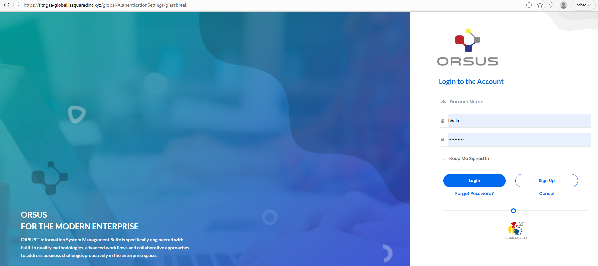
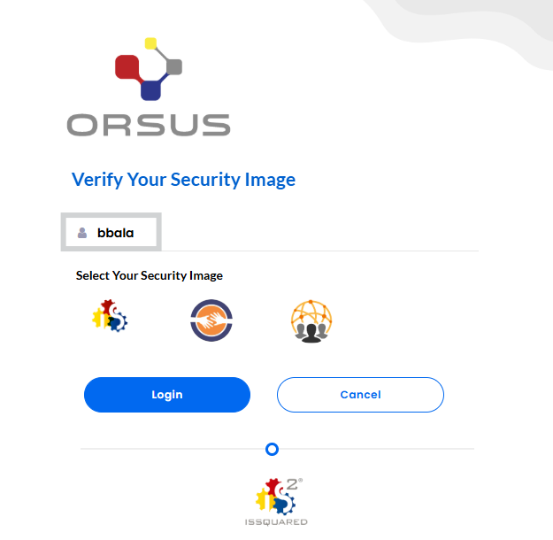
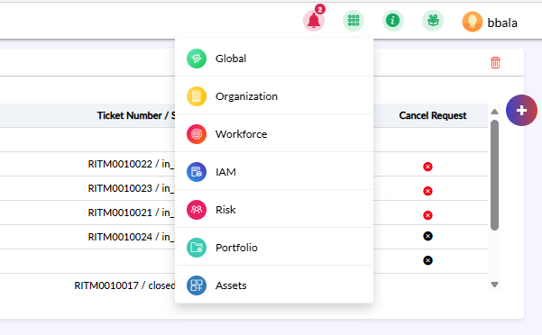

# Enterprise Business Integration Solutions (EBIS) Training (Organization module)

Simplified, Unified and Intuitive Console to Streamline IT Business Processes

## Objectives

**Introduction**

- Understand the Organization Module's purpose and its role as the foundational setup for FSM, Workforce, and Assets

**Accessing the Platform**

- Log in and navigate to the Organization Module using the correct environment.

**Prerequisites**

- Identify key configurations required before using the module, including tenant setup, authentication, and role assignments

**Performing Core Tasks**

- Create and manage organizations, hierarchies, locations, contracts, and intellectual property information.

**Administration Tab**

- Configure email templates, domain management, grid schema, and dropdown customizations.

**Dependencies**

- Understand how Organization Module data supports FSM, Workforce, and Asset modules

## What is EBIS

- ISSQUARED EBIS is an enterprise platform that centralizes and integrates core business operations such as Human Resources, Projects, Assets, Inventory, and Organizational data into a single unified system.

- Automates repetitive operational tasks.
- Manages employees, roles, onboarding, and workforce data.
- Tracks projects, portfolios, and performance.
- Manages assets, inventory, and operational records.
- Provides live operational insights across departments.
- Enables secure information sharing across teams.
- Supports role-based access and data governance.
- Integrates workforce and organizational data with other solutions

## Accessing the Platform – Prerequisites

- Before accessing EBIS, ensure all required configurations and user access setup activities are completed successfully. Users must have valid login credentials and appropriate permissions assigned by the administrator.

## Accessing the Platform – Flow

- Access the ORSUS Portal
- Use the login credentials provided by your Organization.
- Enter your username and password to access the EBIS Portal.

{width=90%}

- Connect via ORSUS
- Once logged in, you will see the ORSUS interface.
- Select Organization Module from the Modules dropdown list.

{width=83%}

{width=86%}

