# Organization – Administration – General

## Organization – Administration – General

- The Domains section is used to maintain domain registration and SMTP-related configuration details within the Administration module.

- Users can:
- Create and manage organizational domains.
- Track registration and renewal dates.
- Configure SMTP domain mappings.
- Maintain registrar and account information.
- Store authentication and operational notes.
- Navigation Path
- Administration → General

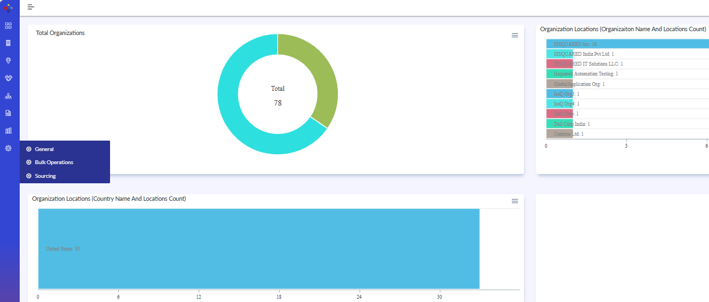{width=93%}

## Organization – Administration – General (continued)

- The General section under Administration provides centralized configuration options for:
- Domains
- Email Templates
- Error Logs
- Grid Schema
- List Entries
- Metric Templates
- SMTP Domains
- Users can access the Domains configuration screen from this section.

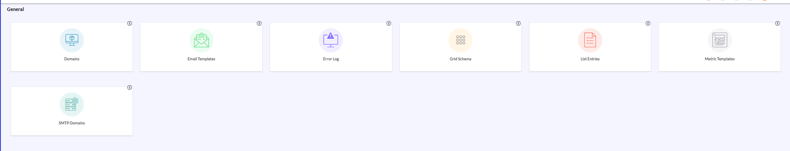{width=98%}

## Organization – Administration – General – Domains

- Important Navigation and Workflow
- Note:
- The Domains module follows a centralized configuration workflow.
- Users should:
- Create SMTP Domains before mapping them to Domains records.
- Enter registration and renewal information.
- Configure registrar and account details.
- Associate SMTP Domains where applicable
- Save the configuration after verification.
- Create and Edit operations follow the same screen layout and workflow.

## Organization – Administration – General – Domains (continued)

- The Domains screen is used to maintain internet domain registrations associated with the organization. This information helps administrators track registration details, renewal dates, registrar information, account credentials, and related SMTP domains.

- Click Create from the Domain List screen.
- Enter the Domain Name.
- Specify the Registration Date and Renewal Date.
- Select the appropriate Currency and enter the Cost of Registration.
- Enter the Domain Registrar and Registration Account Number.
- Provide the User Name and Password for the registrar account.
- Select the associated SMTP Domain.
- Enable Domain Private if domain ownership information should remain private.
- Enter the relevant Address information.
- Add any additional information in the Notes section.
- Click Save to create the domain record or Save & New to create another domain.

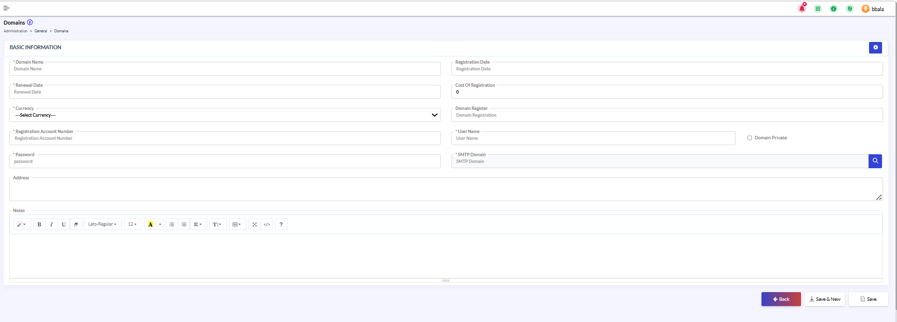{width=94%}

## Organization – Administration – General – Domains (continued 3)

- Edit/Modify Domains
- Select an existing domain and click Edit.
- Update the Domain Name.
- Review and modify registration and renewal information as required.
- Update the registration cost, currency, and registrar details.
- Maintain registrar account information, including account number, username, and password.
- Update the linked SMTP Domain.
- Enable or disable Domain Private as required.
- Update address information and administrative notes.
- Click Save to apply the changes or Save & New to save the current record and create another domain.

- Note: Changes made to a domain record may impact domain management, registration tracking, and SMTP associations. Ensure the information is reviewed before saving.

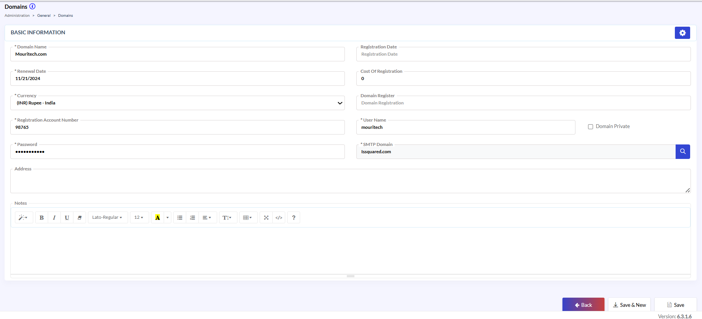{width=93%}

## Organization – Administration – General – Email Template

- Create or Edit Email Template.
- Navigate to Administration → General → Email Templates.
- Click Create to add a new template, or select an existing template and click Edit.
- Enter or update the template name and subject.
- Select the appropriate template type and associated business object.
- Configure template attributes as required.
- Enable or disable notification settings as applicable.
- Update the email content within the Template Body section.
- Modify descriptions and notes as needed.
- Click Save to apply the changes or Save & New to create another template.
- Note: Changes to an email template may affect automated notifications and email communications generated by the system.

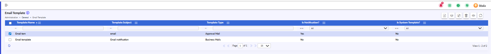{width=93%}

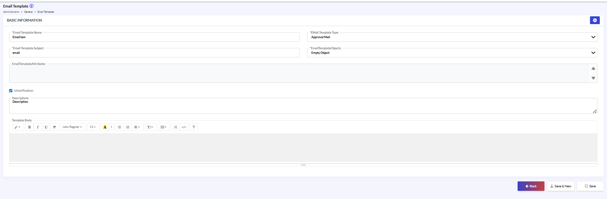{width=93%}

## Organization – Administration – General – Error Log

- Error Log
- Use the available filters to locate specific error records.
- Review error details, exception information, affected modules, and associated users.
- Analyze the information for troubleshooting purposes.

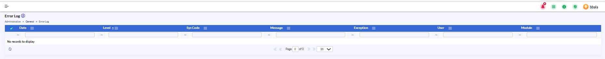{width=99%}

- Note: Error Log records are generated automatically by the system and are intended for monitoring and diagnostic activities.

## Organization – Administration – General – Grid Schema

- Grid Schema.
- Select the required Grid Name from the dropdown list.
- Review the list of available columns associated with the selected grid.
- Enable or disable column visibility using the corresponding checkboxes.
- Review the display order of the columns as shown in the grid.
- Click Save to apply the changes.
- Click Restore Defaults to revert the grid configuration to the system default settings.
- Click Back to return to the previous screen.
- Note: Grid Schema settings control how information is displayed within application grids and list views.

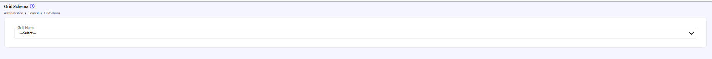{width=95%}

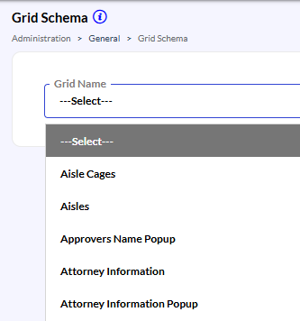{width=20%}

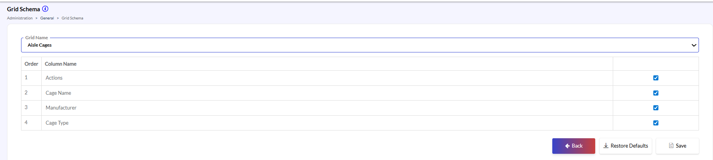{width=95%}

## Organization – Administration – General – List Entries

- The List Entries screen is used to manage configurable lookup lists that are referenced throughout the application. Administrators can maintain list definitions and their associated values, which populate dropdown menus and selection fields across various modules.

- Navigate to Administration → General → List Entry.
- Select an existing record and click Edit Icon.
- Update the List Entry information.
- Review the Entry Type and Status settings.
- Click Save to apply the changes.

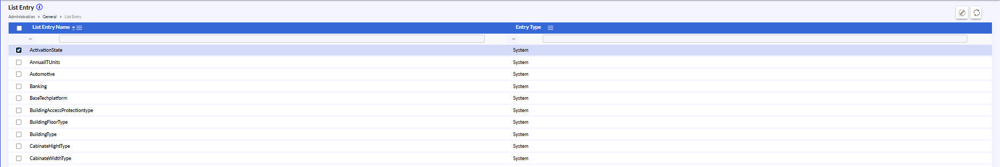{width=91%}

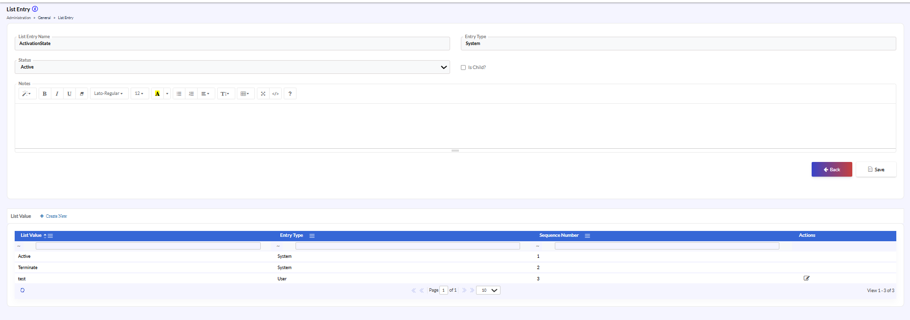{width=95%}

## Organization – Administration – General – List Entries (continued)

- Configure the Is Child option if the list entry is dependent on another list.
- Add the List Entry Name using the dropdown if the list entry is dependent on another list.
- Add notes or additional information as required.
- Click Save to apply the changes.

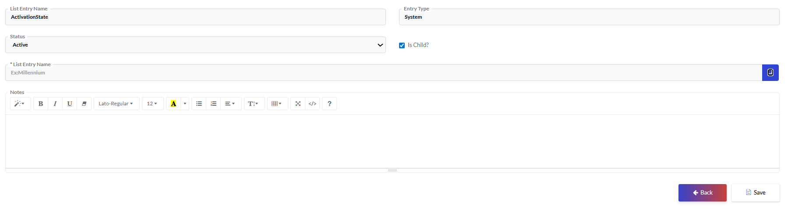{width=95%}

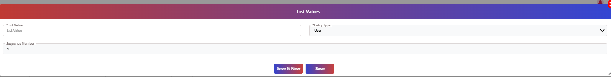{width=94%}

## Organization – Administration – General – Metric Templates

- The Metric Templates section is used to create and manage reusable scoring templates. A Metric Template defines a collection of evaluation metrics, along with their weights and scoring ranges, which can be used consistently across assessments, supplier evaluations, audits, or other business processes.

- To Create a Metric Template
- Navigate to Administration > General > Metric Templates.
- Click the Create icon.
- Enter the Template Name.
- Optionally enter notes describing the purpose of the template.
- Click Save to create the template.
- Use the Metric Template Values section to add individual metrics.
- Click Create New within the Metric Template Values section.
- Enter the metric details and scoring configuration.
- Click Save or Save & New.
- Click Save to finalize the template.

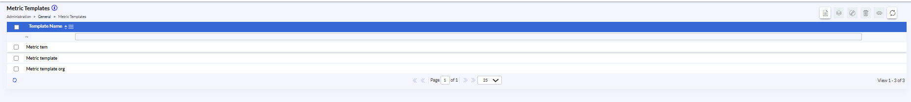{width=95%}

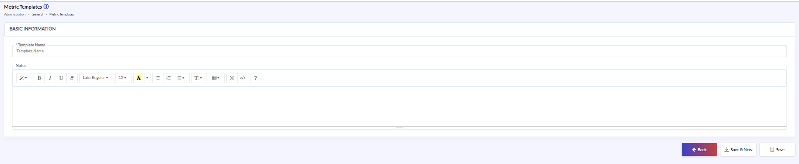{width=95%}

## Organization – Administration – General – Metric Templates (continued)

- To Edit a Metric Template
- Navigate to Administration > General > Metric Templates.
- Select the required template.
- Click the Edit icon.
- Update the Template Name or Notes as required.
- Add, modify, or remove Metric Template Values.
- Click Save to apply the changes.

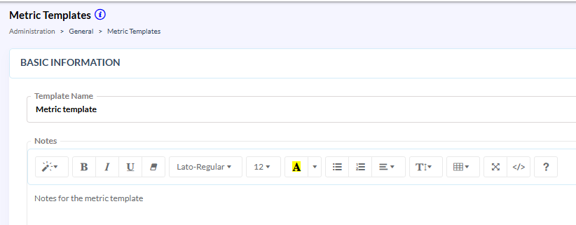{width=83%}

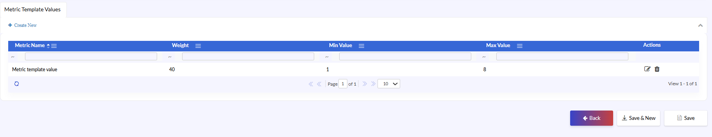{width=95%}

- To Add a Metric Value
- Open the required Metric Template.
- In the Metric Template Values section, click Create New.
- Enter the metric configuration details.
- Click Save or Save & New.

## Organization – Administration – General – Metric Templates (continued 3)

- To Add a Metric Value
- Open the required Metric Template.
- In the Metric Template Values section, click Create New.
- Enter the metric configuration details.
- Click Save or Save & New.
- To Edit a Metric Value
- Open the required Metric Template.
- Locate the metric in the Metric Template Values grid.
- Click the Edit icon in the Actions column.
- Update the required information.
- Click Save.

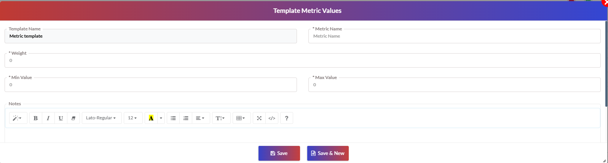{width=88%}

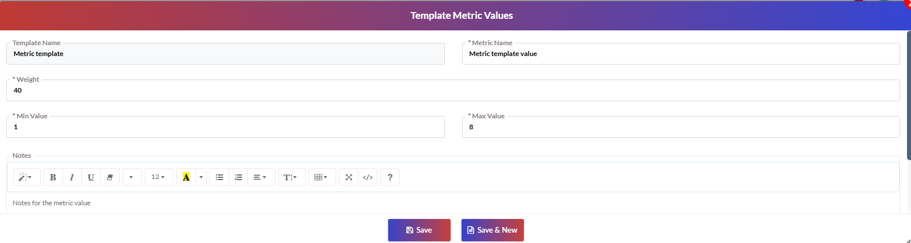{width=88%}

## Organization – Administration – General – SMTP Domains

- The SMTP Domains section is used to maintain the list of approved email domains that can be associated with email configurations, domain records, and outbound communication processes within the system.

- To Create an SMTP Domain
- Navigate to Administration > General > SMTP Domains.
- Click the Create icon.
- Enter the SMTP Domain Name.
- Optionally enter Notes to describe the domain.
- Click Save to create the record.
- Click Save & New to save the current record and create another SMTP Domain.

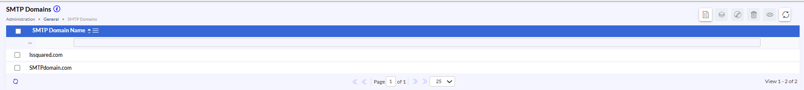{width=93%}

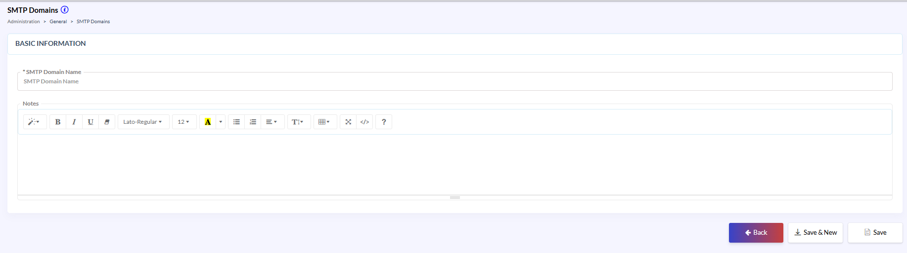{width=94%}

## Organization – Administration – General – SMTP Domains (continued)

- To Edit an SMTP Domain
- Navigate to Administration > General > SMTP Domains.
- Select the required SMTP Domain record.
- Click the Edit icon.
- Update the SMTP Domain Name or Notes as required.
- Click Save to apply the changes.

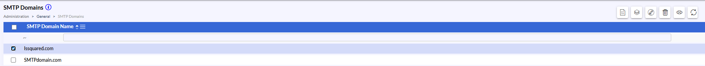{width=93%}

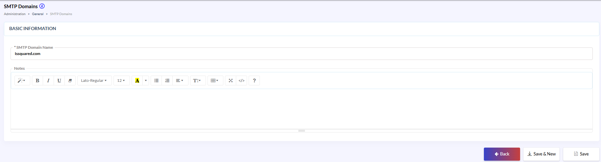{width=94%}

## Thank You!

{width=84%}

- For further queries, reach out to us at:
- support@issquared.net
