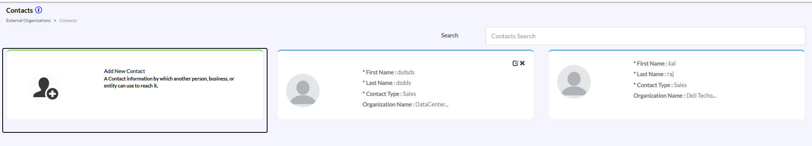
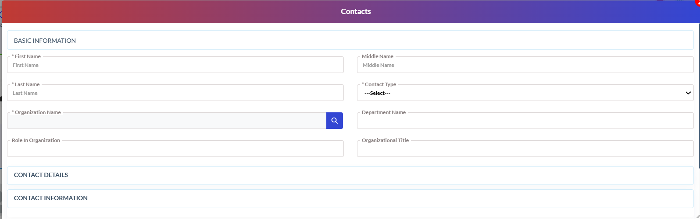
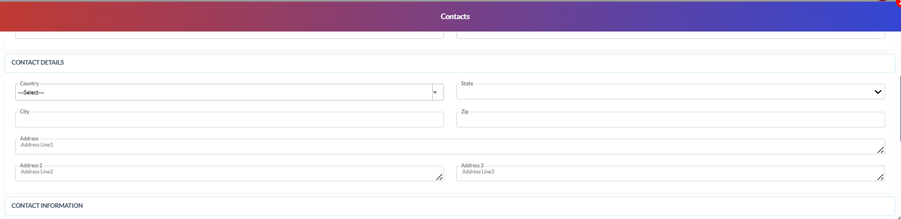
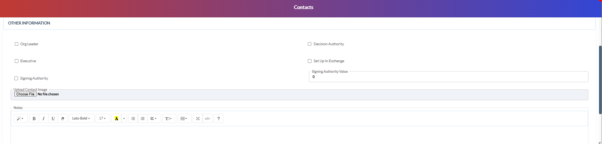

# Organization – Contacts

## Organization – Contacts

- The Contacts section is used to create and maintain contact records associated with external organizations. Users can store personal, organizational, communication, and authority-related information for business contacts.

- Navigation Path
- External Organizations → Contacts

{width=84%}

## Organization – Contacts (continued)

- Create / Edit Contact.
- Navigate to External Organizations → Contacts.
- To create a new contact:
 - Click Add New Contact.
- To modify an existing contact:
 - Open the required contact record using the edit icon or search option.
- Enter or update the required information in:
**Basic Information**
**Contact Details**
**Contact Information**
**Other Information**
- Review all information carefully.
- Click Save / Update.

{width=86%}

## Organization – Contacts (continued 3)

**Basic Information Section**
- The Basic Information section is used to maintain primary contact and organizational details.
- Users can enter or modify:
 - First Name
 - Middle Name
 - Last Name
 - Contact Type
 - Organization Name
 - Department Name
 - Role in Organization
 - Organizational Title

{width=86%}

## Organization – Contacts (continued 4)

**Contact Details**
- The Contact Details section is used to maintain address-related information for the contact.
- Users can enter or modify:
- Country
- State
- City
- Zip Code
- Address Line 1.
- Address Line 2.
- Address Line 3.

{width=90%}

## Organization – Contacts (continued 5)

**Contact Information Section**
- The Contact Information section is used to maintain additional communication and contact-related information.
- Users can expand this section to enter supplementary communication details as required by organizational standards.

{width=94%}

## Organization – Contacts (continued 6)

**Other Information Section**
- The Other Information section is used to configure executive authority, leadership designation, and additional organizational details.

- Users can:
- Mark executive-level contacts.
- Configure signing authority.
- Maintain exchange-related details.
- Upload contact images.
- Add operational notes.

{width=88%}

## Organization – Contacts (continued 7)

- Common Actions Reference
- The following actions are common throughout the Contacts module:
- Create
- Edit
- Save
- Save & New.
- Search
- View
- Refresh
- These actions follow the same behavior throughout the application.
