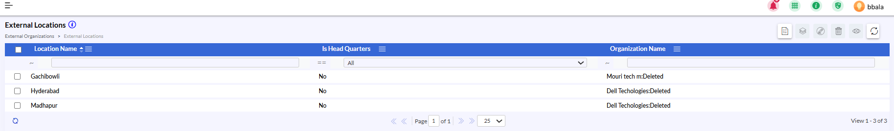
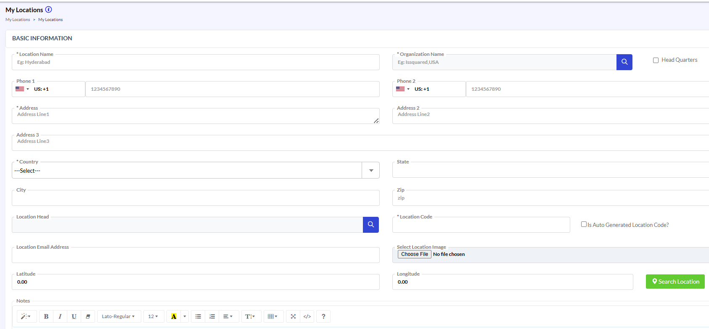
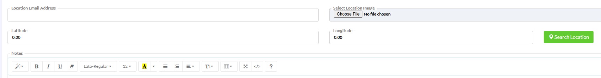
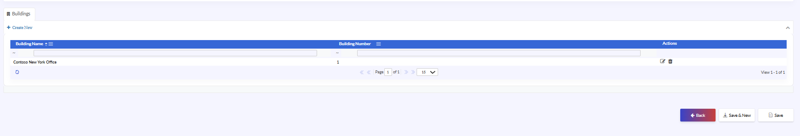
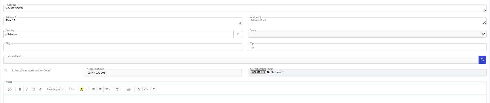

# Organization – External Locations

## Organization – External Locations

- Navigate to External Organizations → External Locations.
- Review the list of available external locations.
- Use the available filters to search by:
 - Location Name
 - Headquarters Status
 - Organization Name
- Select the required location record.
- Use the available actions to:
 - View location details
 - Edit existing records
 - Delete records if permitted

{width=93%}

{width=95%}

## Organization – External Locations (continued)

- Create / Edit External Location.
- The Create / Edit External Location screen is used to maintain detailed address, communication, and operational information for external organization locations.
- This screen also serves as the parent configuration layer for buildings associated with the location.

**Basic Information**
**Location Details**
- Enter the Location Name.
- Select the associated Organization Name.
- Enter:
 - Phone 1
 - Phone 2
 - Location Email Address
- Enable the Head Quarters option if the location is the organization’s headquarters.

{width=95%}

{width=89%}

## Organization – External Locations (continued 3)

{width=94%}

**Address Information**
- Enter:
 - Address Line 1.
 - Address Line 2.
 - Address Line 3.
- Select the Country.
- Select the appropriate State.
- Enter:
 - Other State (if applicable)
 - City
 - ZIP Code

**Operational Information**
- Enter the Location Head information.
- Enable Is Auto Generated Location Code? if automatic code generation is required.
- Enter or verify the Location Code.

## Organization – External Locations (continued 4)

- Image and Notes
- Upload the required Location Image if applicable.
- Use the Notes section to provide additional location details.
- Review all entered information carefully.
- Click Save / Update to apply the changes.

{width=95%}

## Organization – External Locations – Buildings

- The Buildings section is used to manage buildings associated with the selected external location.
- This section supports:
- Building hierarchy management
- Infrastructure expansion
- Physical facility tracking

- Buildings Grid
- Navigate to the Buildings section within the External Location screen.
- Review existing building records.
- Click Create New to add a new building.
- Use available actions to:
 - Edit building details
 - Delete building records
- Review all information before proceeding.

{width=97%}

## Organization – External Locations (continued 5)

**Address Information**
- Enter:
 - Address Line 1.
 - Address Line 2.
 - Address Line 3.
- Select the Country and State.
- Enter:
 - Other State (if applicable)
 - City
 - ZIP Code

{width=96%}

**Operational Information**
- Enter the Location Head information.
- Enable Is Auto Generated Location Code? if automatic code generation is required.
- Enter or verify the Location Code.
- Upload the required Location Image if applicable.
- Use the Notes section to provide additional location details.
- Click Save / Update to apply the changes.
