# Organization – External Organizations

## Organization – External Organizations

- The External Organizations module is used to create, manage, and maintain information related to third-party organizations, vendors, partners, subsidiaries, clients, and associated business entities.

- Once users navigate to External Organizations section, they can:
- Create new external organizations.
- Modify existing organization records.
- Maintain organization hierarchy and classifications.
- Manage contacts, documents, domains, entitlements, and operational information
- Track organization-related applications and issues.

{width=84%}

## Organization – External Organizations (continued)

- The External Organizations module is used to create, manage, and maintain information related to third-party organizations, vendors, partners, subsidiaries, clients, and associated business entities.

- Navigate to 
- Organization → External Organizations
- The system displays the External Organizations listing screen.

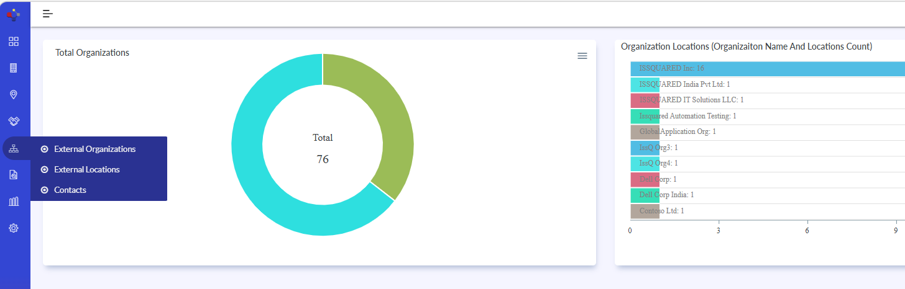{width=82%}

- The listing screen displays all available external organization records in a searchable grid format.
- The grid includes:
- Organization Name
- Organization Generated ID
- Top Parent Status
- Number of Locations
- Website
- Activation State

{width=87%}

## Organization – External Organizations – Common Toolbar Actions

- The toolbar options such as:
 - Clone
 - Delete
 - View
 - Refresh
- have already been explained in the My Organization section and follow the same behavior throughout the application.
- Use these options to:
 - Duplicate existing records.
 - Remove records
 - Open records in read-only mode.
 - Reload the latest data.

{width=98%}

## Organization – External Organizations (continued 3)

- Create / Edit External Organization.
- Navigate to the External Organizations screen.
- To create a new organization record, open the organization creation screen.
- To modify an existing organization:
 - Select the required organization record from the listing screen.
 - Open the organization details screen.
- In the Organization Name field, enter or update the organization name.
- Select the appropriate Activation State.
- If the organization belongs to a parent organization:
 - Locate the Parent Organization field.
 - Search and select the required parent organization.

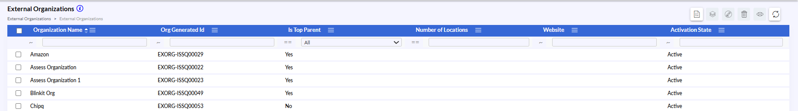{width=82%}

{width=86%}

## Organization – External Organizations (continued 4)

- Enable the Top Parent option if the organization is the primary parent organization.
- Enter or update:
 - Website details
 - Resolver Group
 - Phone numbers
 - Service Catalogue ID
- Select organization classifications such as:
 - Market Tier
 - Organization Tier
 - Primary Vertical
 - Secondary Vertical
- Review the generated organization ID and domain validation settings.

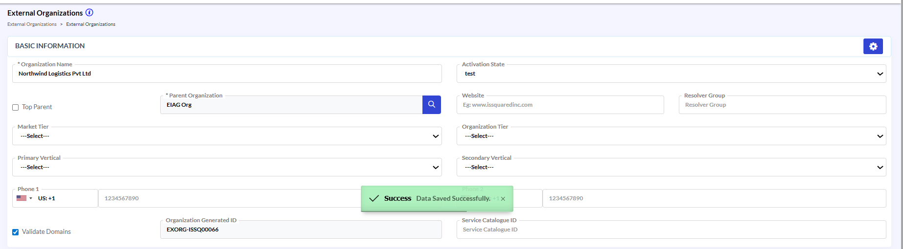{width=86%}

## Organization – External Organizations (continued 5)

**Additional Details**
- Navigate to the Additional Details tab.
- Select the appropriate Region.
- Enter or update the:
 - Number of Employees
 - District
 - Sub District
 - Number of Locations
- Review all entered details carefully.
- Click Save / Update to apply the changes.

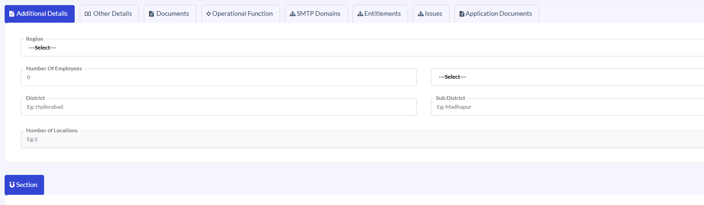{width=85%}

## Organization – External Organizations (continued 6)

**Other Details**
- Navigate to the Other Details tab.
- In the Base Technology Platform field:
 - Select the primary technology platform used by the organization.
- Enter the Annual IT Budget value.
 - Select the corresponding currency and financial category where applicable.
- Enter the organization’s Market Cap value.
 - Select the appropriate currency and classification.

{width=85%}

## Organization – External Organizations (continued 7)

- Enable the International Company option if the organization operates internationally.
- Enable the Security Clearance Required option if additional security validation is needed for engagements.
- Enter the required Trade Code information.
- Enter details related to:
 - Listed In Exchange
 - Outsourcing Affinity
 - Information Created Through
- Upload the organization image if required.
- Use the Notes section to enter any additional business remarks or references.
- Click Save / Update to apply the changes.

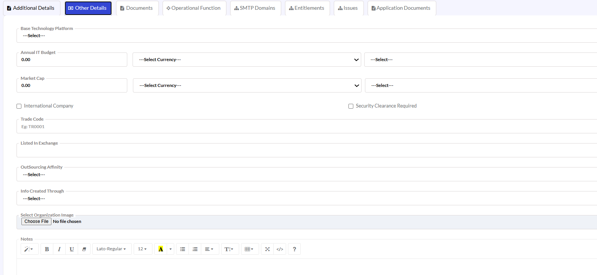{width=87%}

## Organization – External Organizations (continued 8)

- Documents
- Navigate to the Documents tab.
- Click Create New to add a new document record.
- Enter or select:
 - Document Title
 - Document Version
 - Document Type
- Review template and inheritance details if applicable.
- Upload or associate the required document.
- Verify all document information carefully.
- Click Save / Update to apply the changes.

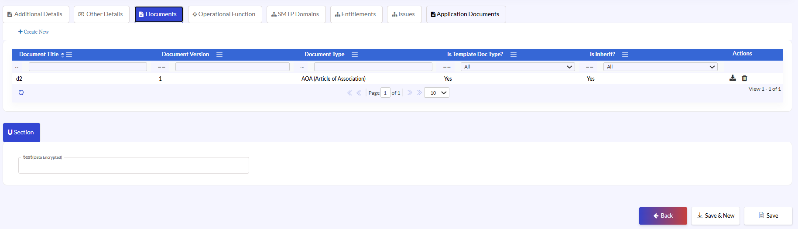{width=87%}

## Organization – External Organizations (continued 9)

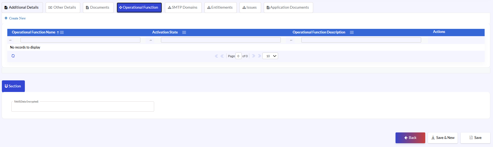{width=87%}

- Operational Function
- Navigate to the Operational Function tab.
- Click Create New to add a new operational function.
- Enter or update:
 - Operational Function Name
 - Activation State
 - Operational Function Description
- Review all operational function details carefully.
- Click Save / Update to apply the changes.

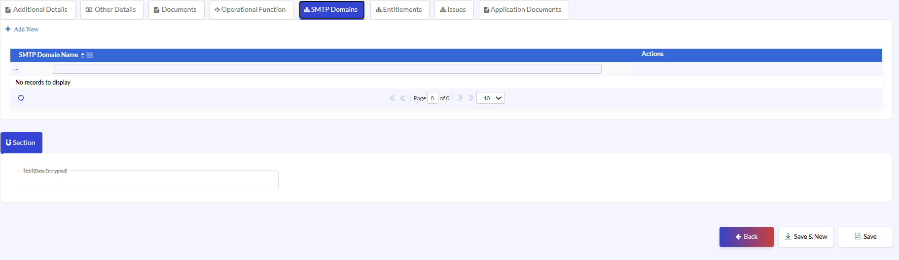{width=81%}

- SMTP Domains
- Navigate to the SMTP Domains tab.
- Click Add New to create a new SMTP domain entry.
- Enter the required SMTP domain name.
- Verify the domain information carefully.
- Click Save / Update to apply the changes.

## Organization – External Organizations (continued 10)

- Entitlements
- Navigate to the Entitlements tab.
- Add or update entitlement-related information as required.
- Review all entitlement configurations carefully.
- Click Save / Update to apply the changes.

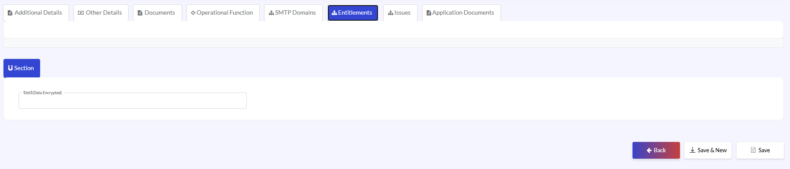{width=86%}

- Issues
- Navigate to the Issues tab.
- Review the available issue records.
- Add or update issue information where applicable.
- Verify:
 - Application Name
 - Business Description
 - Technical Description
- Review all issue details carefully.
- Click Save / Update to apply the changes.

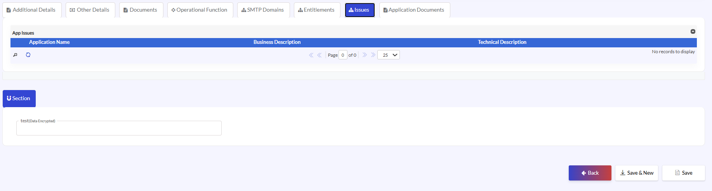{width=86%}

## Organization – External Organizations (continued 11)

**Application Documents**
- Navigate to the Application Documents tab.
- Review existing application document records.
- Add or associate new application documents where required.
- Verify:
 - Application Name
 - Organization
 - Document Name
- Review all entered information carefully.
- Click Save / Update to apply the changes.

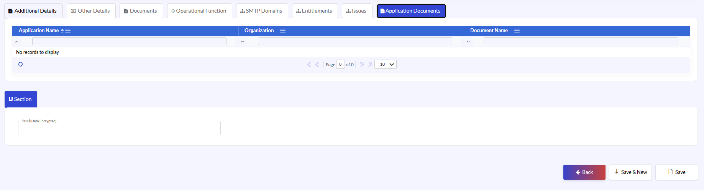{width=87%}
