# Organization – Intellectual Property

## Organization – Intellectual Property

- This section allows administrators to create and manage intellectual property records such as copyrights, patents, and trademarks. It helps track ownership details, application information, publication dates, renewals, assigned organizations, and related costs.

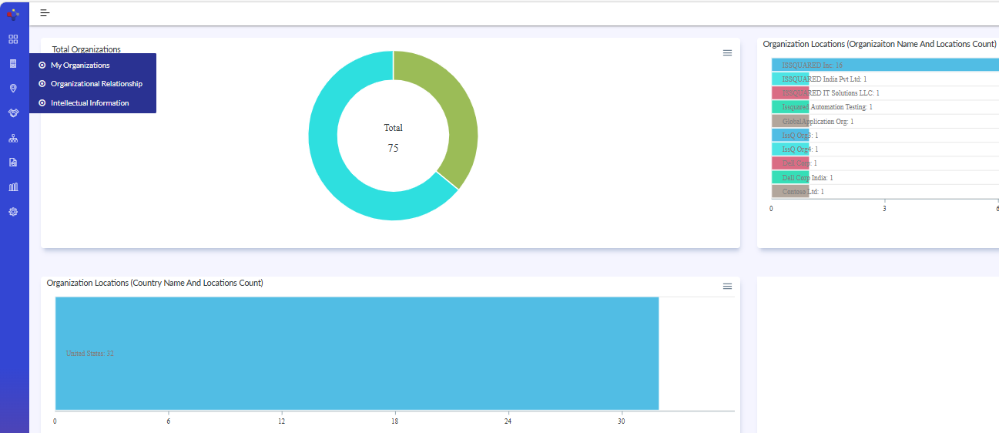{width=96%}

## Intellectual Property – Create New Record

- To Create New IP Record:
- Select the required Intellectual Property Type such as Copyright, Patent, or Trademark.
- Enter the IP Title and Parent Name details. Select the Applied Country where the intellectual property is registered or applied.
- Enter the Application Date, Publication Date, Application Number, and Expiry Date details.
- Provide the Renewal Period and configure renewal-related information if applicable.
- Enter Renewal Cost and select the required currency value.
- Specify the notification frequency and notification email details for renewal reminders.
- Select the Current Assignee Organization and Original Assignee Organization if applicable.
- Click Save to create the intellectual property record.
- Click Save & New to immediately create another IP entry if required.

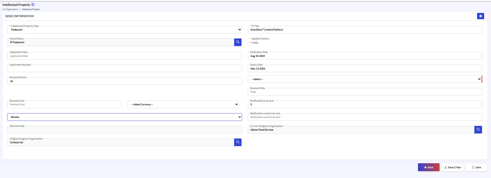{width=93%}

## Intellectual Property – Edit Intellectual Property Details

- To edit Intellectual Property Details:
- Navigate to Organization > Intellectual Property.
- Select the required intellectual property record from the list view.
- Click the Edit icon.
- Update the required details such as Intellectual Property Type, IP Title, Applied Country, Publication Date, Expiry Date, Renewal Information, Notification Details, or Assignee Organization details.
- Verify the updated information carefully.
- Click Save / Update to apply the changes.

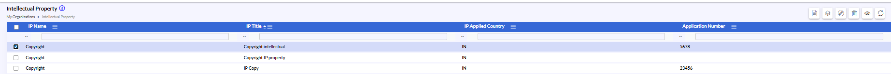{width=93%}

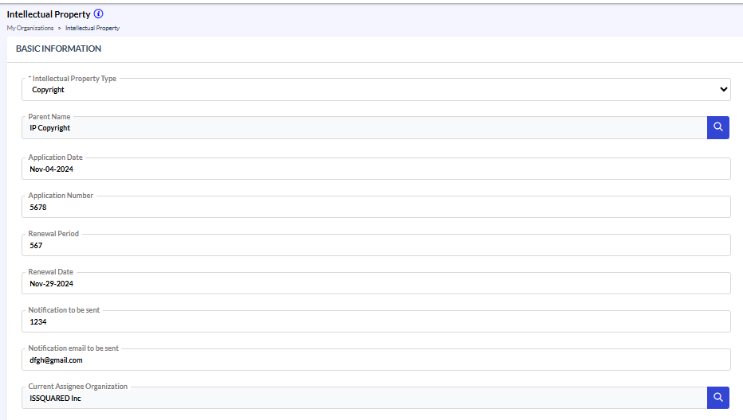{width=84%}

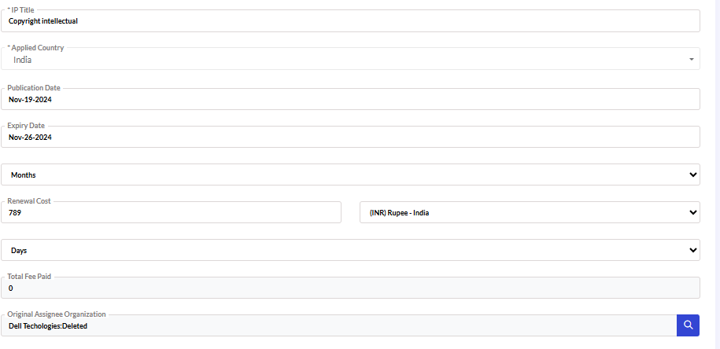{width=85%}

{width=93%}

## Intellectual Property – Edit Intellectual Property Details (continued)

**Documents Tab**
- Use the Create New option to add a new document record. Upload or manage intellectual property-related supporting documents such as copyright certificates, trademark files, patent documents, agreements, or legal attachments. Click Save / Update to apply the changes.

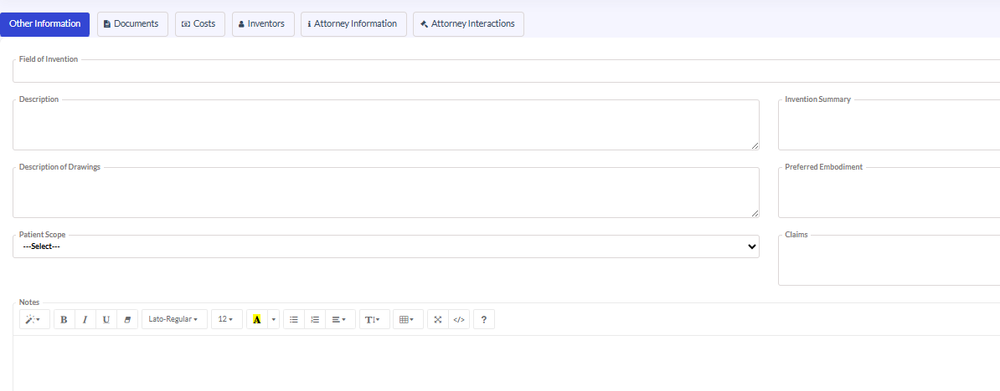{width=92%}

**Costs Tab**
- Use the Create New option to add a new cost record associated with the intellectual property. Maintain financial information such as Invoice Number, Invoice Date, PO Number, Payment Due Date, renewal charges, legal expenses, or maintenance costs. Click Save / Update to apply the changes.

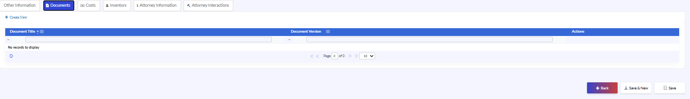{width=93%}

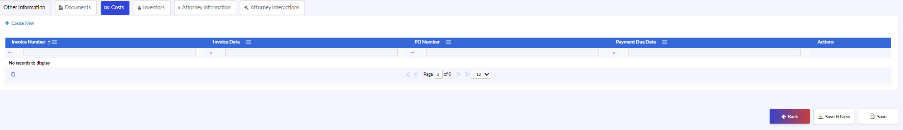{width=93%}

## Intellectual Property – Edit Intellectual Property Details (continued 3)

**Inventors Tab**
- Use the Create New option to associate inventor records with the intellectual property.
- Add or manage inventor-related information such as Organization Name and User Name.
- Click Save to apply the changes.

**Attorney Information Tab**
- Use the Create New option to add attorney or legal representative details associated with the intellectual property record.
- Maintain attorney-related information such as Attorney Title, Organization Name, Engagement Start Date, and Engagement End Date.
- Click Save / Update to apply the changes.

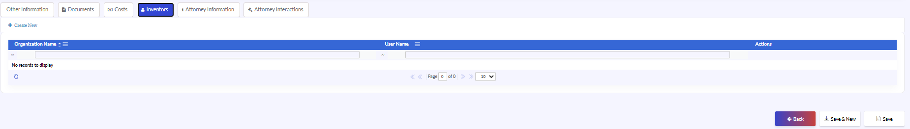{width=93%}

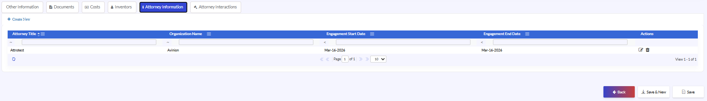{width=93%}

**Attorney Interactions Tab**
- Add or update details such as Conversation Date, Conversation Title, and Conversation Type.
- Maintain communication history, legal follow-ups, and interaction tracking information wherever applicable.
- Click Save to apply the changes.

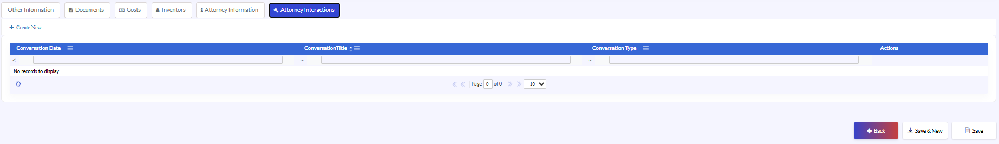{width=94%}
