# Organization – My Locations
The My Locations module is used to create, manage, and maintain organization location records within the platform. It allows administrators to configure location-specific information such as office locations, branches, facilities, addresses, contact details, and location hierarchy associated with organizations.

To access the My Locations, open the main navigation menu from the left panel
- Navigate to My Locations.

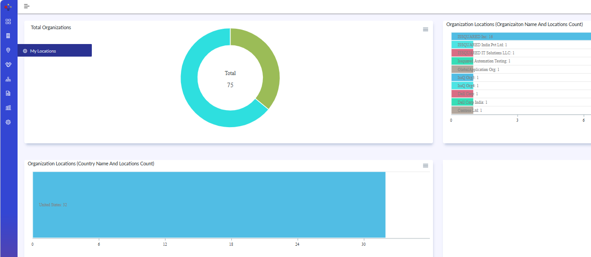{width=94%}

### Basic Information

- Open the My Locations screen and create a new location record.
- Enter the required details such as Location Name and Organization Name.
- Provide contact details including Phone 1 & 2 information.
- Enter Address, address 2, and Address 3 details as required.
- Select the Country and State values and enter City and Zip details.
- Assign the Location Head if applicable.
- Enter the Location Email Address for communication purposes.
- Specify the Location Code or enable the auto-generated location code option if required.
- Enable the Head Quarters option if the location represents the organization’s primary headquarters.
- Upload a location image if applicable.
- Enter Latitude & Longitude values or use the Search Location option to identify the geographical location.
- Use the Notes section to capture additional information.
- Click Save or Save & New.

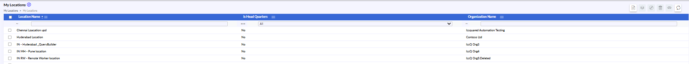{width=93%}

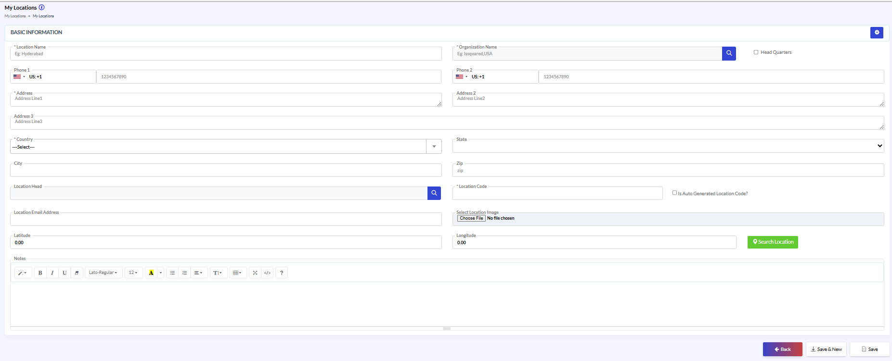{width=93%}

### Additional Information

- Navigate to the Additional Information tab under the Buildings section.
- Maintain additional building contact and address-related information such as Phone 1, Phone 2, address details, Country, State, City, and Zip information.
- Review all entered address and contact information carefully before saving.
- Click Save / Update to apply the changes.

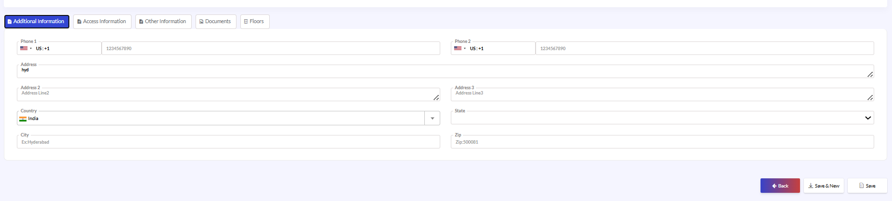{width=98%}

### Access Information

- Navigate to the Access Information tab.
- Maintain building access-related information and security access details wherever applicable.
- Update access configurations and related operational details based on business requirements.
- Review all entered information carefully before saving.
- Click Save / Update to apply the changes.

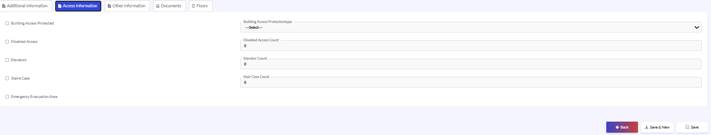{width=96%}

### Other Information

- Navigate to the Other Information tab.
- Maintain additional building-specific operational or administrative information configured for the organization.
- Update the required custom or supplementary details as applicable.
- Review all entered information carefully before saving.
- Click Save / Update to apply the changes.

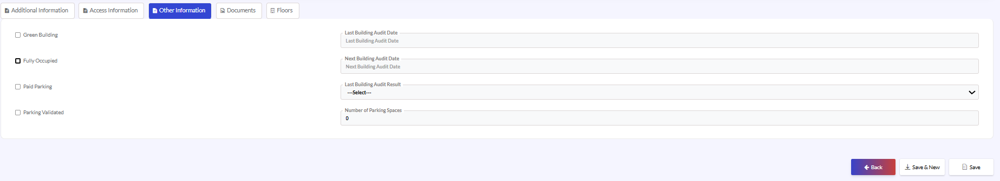{width=98%}

### Documents

- Navigate to the Documents tab.
- Upload, replace, or manage building-related supporting documents and attachments.
- Verify that the correct files are attached before submission.
- Click Save / Update to apply the changes.

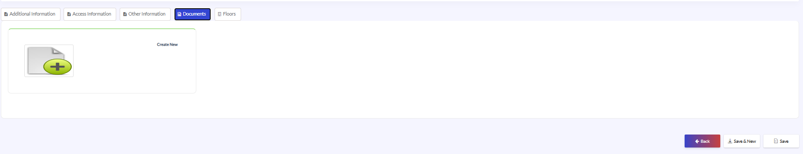{width=98%}

### Floors

- Navigate to the Floors tab.
- Create and manage floor records associated with the selected building.
- Maintain floor-related information such as floor identification, numbering, and associated operational details.
- Review all entered floor information carefully before saving.
- Click Save / Update to apply the changes.

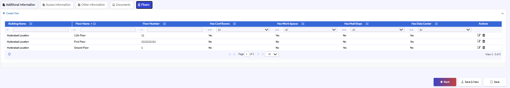{width=98%}

## Edit Location Details

- Select the required location record from the list view.
- Open the selected record in edit mode.
- Update the required details such as address information, contact details, location head, geo-location details, or organization information.
- Modify the location image or notes if required.
- Click Save / Update to apply the changes.

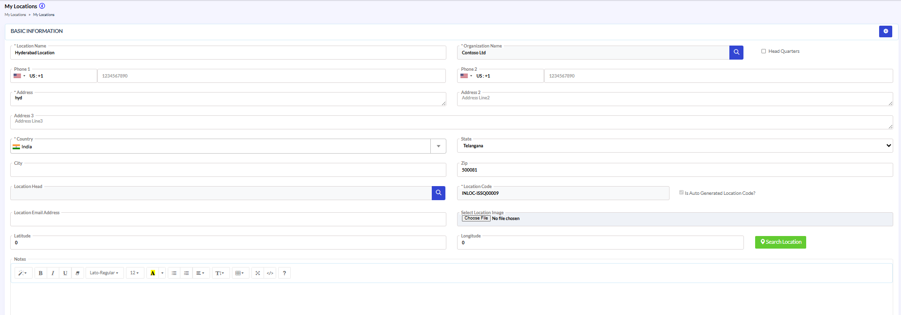{width=96%}

### Basic Information

The Buildings section allows administrators to associate one or more building records with a specific organization location.

- Navigate to the Buildings section under the selected location record.
- Use the Create New option to add a new building record.
- Enter or update details such as Building Name, Building Number, and Primary Building information.
- Enable the Is Primary option for the main building associated with the location if applicable.
- Click Save / Save & New to apply the changes.

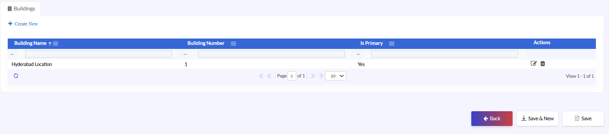{width=94%}

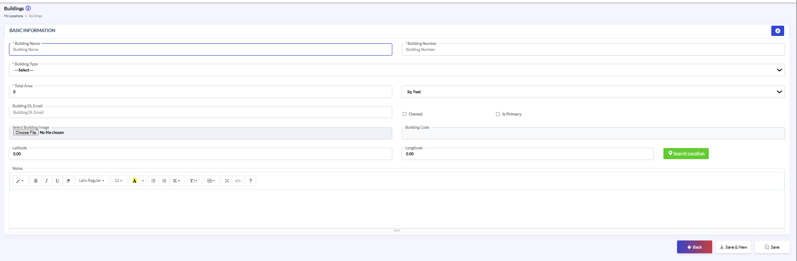{width=93%}

### Additional Information

- Navigate to the Additional Information tab under the Buildings section.
- Maintain additional building contact and address-related information such as Phone 1, Phone 2, address details, Country, State, City, and Zip information.
- Review all entered address and contact information carefully before saving.
- Click Save / Update to apply the changes.

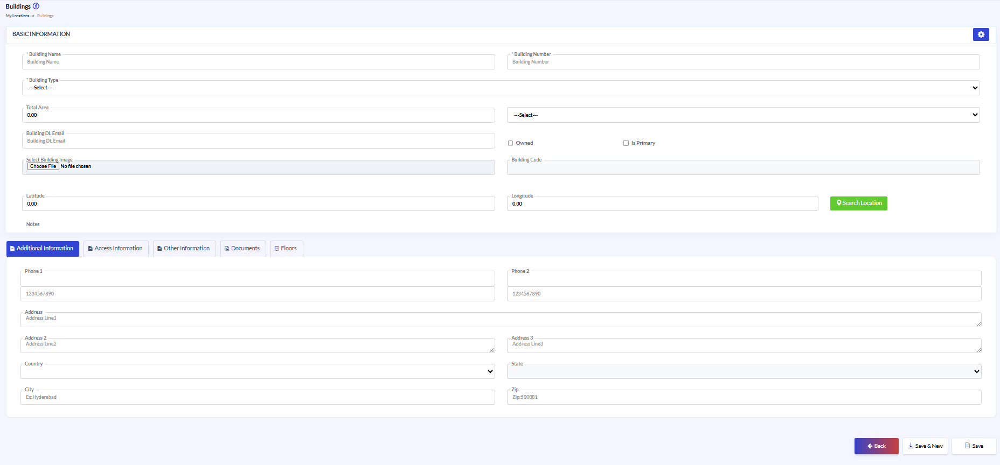{width=97%}

### Edit Location Details – Buildings

- Navigate to the Access Information tab.
- Maintain building access-related information and security access details wherever applicable.
- Update access configurations and related operational details based on business requirements.
- Click Save / Update to apply the changes.

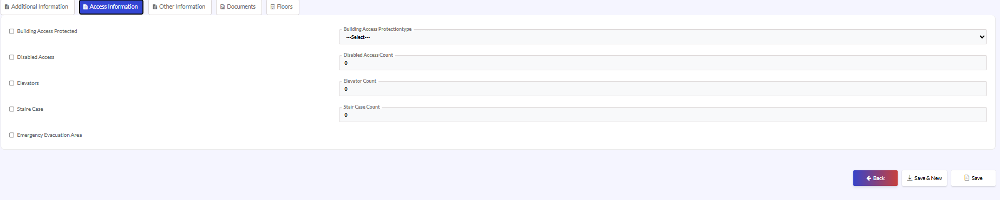{width=98%}

## Other Information Tab

- Navigate to the Other Information tab.
- Maintain additional building-specific operational or administrative information configured for the organization.
- Update the required custom or supplementary details as applicable.
- Review all entered information carefully before saving.
- Click Save / Update to apply the changes.

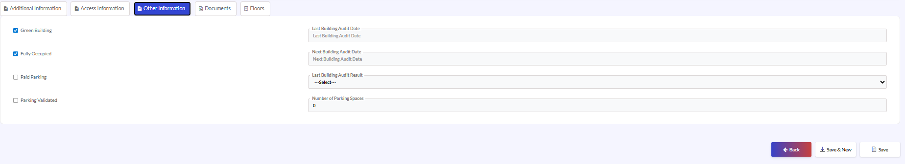{width=99%}

### Documents Tab

- Navigate to the Documents tab.
- Upload, replace, or manage building-related supporting documents and attachments.
- Verify that the correct files are attached before submission.
- Click Save / Update to apply the changes.

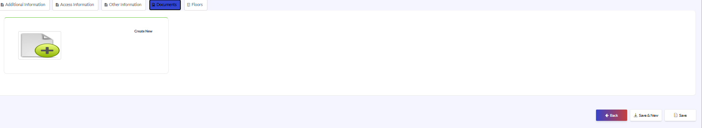{width=98%}

### Floors

- Navigate to the Floors tab.
- Create and manage floor records associated with the selected building.
- Maintain floor-related information such as floor identification, numbering, and associated operational details.
- Review all entered floor information carefully before saving. Click Save / Update to apply the changes.

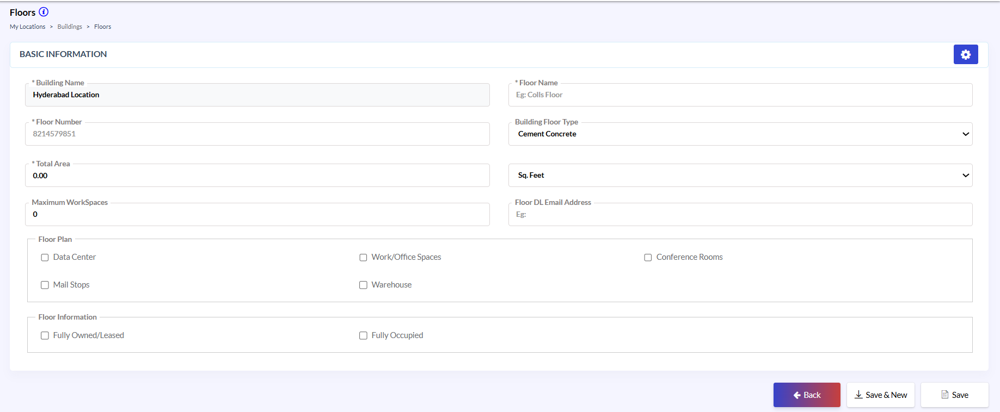{width=95%}

The Floors section allows administrators to create and manage floor-level information associated with a selected building. This section helps maintain floor identification details, floor type, workspace allocation, accessibility features, operational facilities, floor plans, and safety-related information.

- Select the required location and open the associated building record.
- Navigate to the Floors tab under the Buildings section.
- Create a new floor record for the selected building.
- Enter the required floor details such as:
 - Building Name, Floor Name, Floor Number
 - Building Floor Type
 - Total Area
 - Area Measurement Unit
 - Maximum Workspaces
 - Floor DL Email Address

{width=95%}

### Configure Floor Plan

Configure the Floor Plan options based on the facilities available on the floor:
 - Data Center
 - Work/Office Spaces /Conference Rooms
 - Mail Stops /Warehouse
 - Configure the Floor Information options as applicable:
 - Fully Owned/Leased
 - Fully Occupied
- Click Save to create the floor record.

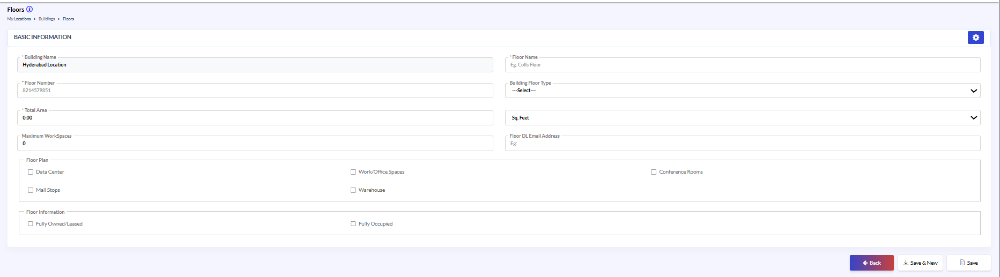{width=97%}
