# My Organizations

To access the My Organizations module, open the main navigation menu from the left panel:
- Navigate to Organization.
- Select My Organizations from the submenu.
- The My Organizations screen displays the list of all configured organization records within the platform

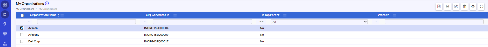{width=99%}

## Create Organization

To create a new organization:
- Click the Create icon from the top toolbar.
- In the Basic Information tab, enter the required organization details such as Organization Name, Parent Organization, Website, Resolver Group, Phone Numbers, and Number of Locations.
- Select the Validate Domains option if domain validation is required.
- Select the Publicly Traded checkbox if the organization is publicly listed.

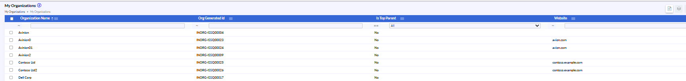{width=98%}

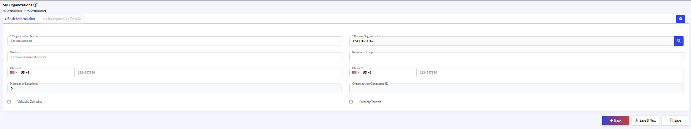{width=99%}

### Incorporation Details

- Click the Incorporation Details tab.
- Enter incorporation details such as Incorporation Name, Incorporation Type, Incorporation Status, Country, State, Incorporation Number, Incorporation Date, Fees, and Costs.
- Select whether the organization is incorporated internally or through a consultancy.
- Enter consultancy details if applicable.
- Click Save to create the organization record.
- Click Save & New to save the current record and create another organization.

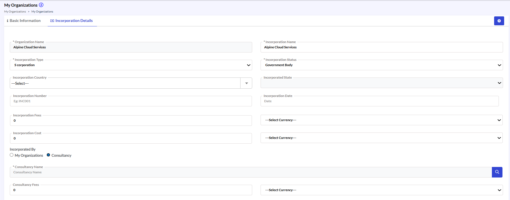{width=95%}

### License Details

Under the License Details tab, review or update:
 - License Name
 - License Type
 - License Status
- Use the Add New option to create additional license records if required.
- In the Other Details section, update the required custom fields and organization-specific information.
- Modify password or confidential fields carefully to maintain data accuracy and security.

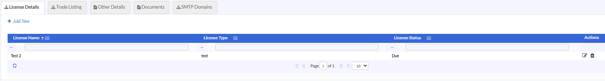{width=95%}

### Trade Listing

In Trade Listing tab.
- Update the required trade-related details and listing information.
- Review the entered values carefully.
- Click Save / Update to apply the changes.

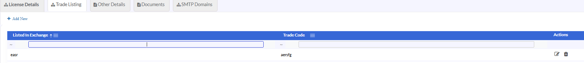{width=95%}

### Other Details

in Other Details tab.
- Update the required custom fields such as:
 - Name fields
 - Identification or Roll Number fields
 - Text fields
 - Date fields
 - Password and confirmation fields
- Ensure all required information is entered correctly.
- Verify password confirmation fields wherever applicable.
- Click Save / Update to apply the changes.

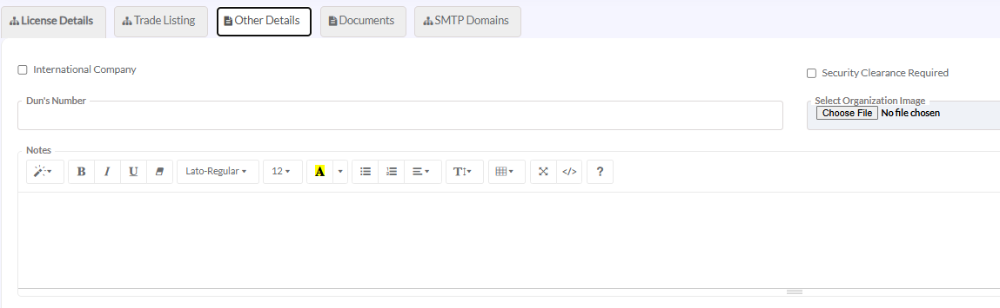{width=93%}

### Documents

In Documents tab:
- Upload, replace, or manage the required organization documents.
- Verify that the correct files are attached.
- Click Save / Update to apply the changes.

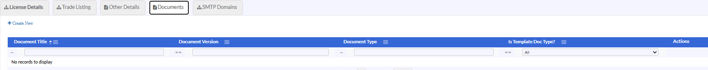{width=93%}

{width=93%}

### SMTP Domains

In SMTP Domains tab:
- Click the option to add or select SMTP domains.
- In the Select SMTP Domain Name window, choose the required SMTP domain from the available list.
- Use the search or filter option to locate a specific domain if required.
- Select the checkbox corresponding to the required SMTP domain.
- Click OK to associate the selected SMTP domain with the organization.
- Click Save / Update to apply the changes.

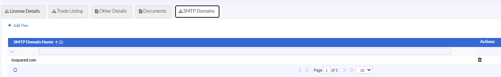{width=97%}

## Create Organization – Settings

The Settings options in Create Organization allow administrators to prepare and configure additional organization-related controls before or after saving the organization record.

- Key Settings Features
- List Values
- Custom Fields
- Administrator Responsibilities
- Configure predefined dropdown values.
- Define additional organization fields
- Prepare security and access configurations
- Maintain organization-specific administrative settings.

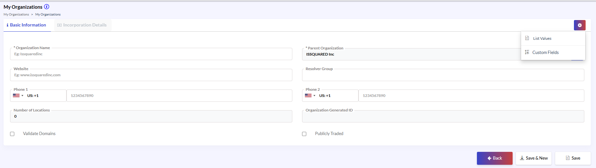{width=95%}

### List Values

The List Values option is used to manage predefined dropdown values used across organization forms and fields.

To configure list values during organization setup, open the Settings menu:
- Select List Values.
- In the List Values screen, locate the required category or field.
- Click Add New to create a new list value.
- Enter the required value details.
- Modify existing values if required.
- Verify the configured information.
- Click Save / Update.

{width=98%}

### Custom Fields

The Custom Fields option is used to create additional fields dynamically for the organization module.
To create a custom field, open the Settings menu. Select Custom Fields.
- Click Add New.
- Enter the Field Name and Label Name.
- Select the required Field Type.
- Enter field option values if the selected field type requires predefined values.
- Select the required Section and Class.
- Enable the Required option if the field must be mandatory.
- Click Save.

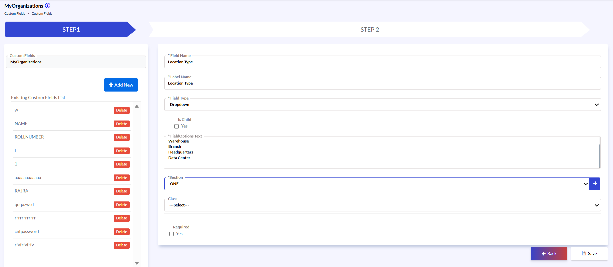{width=93%}

### Add License Record

To create any additional tab for a particular child category of basic or information or Incorporation Details sections (in this case, it’s the License Details tab):
- Click Add New to open the Create License Details screen.
- Enter the required information such as:
 - Organization Name
 - License Name
 - License Type
 - License Status, etc.
- Click Save to create the license record.
- Click Save & New to save the current record and immediately create another license entry if required.

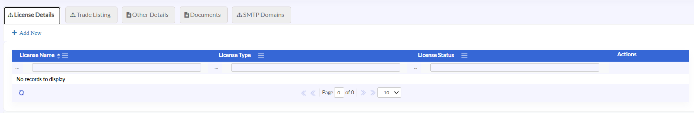{width=95%}

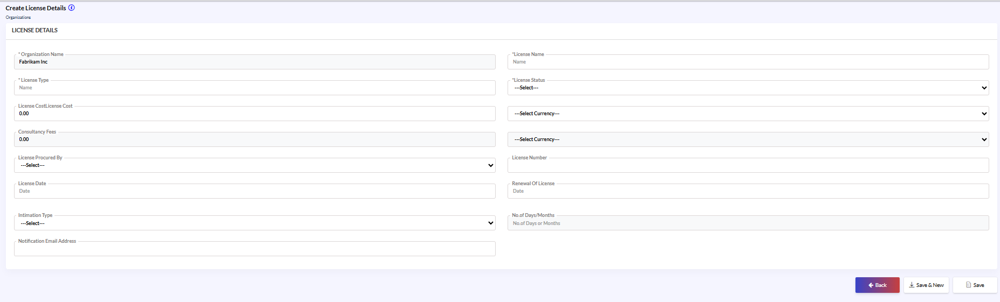{width=95%}

## My Organizations – Edit Organization

**Edit/Modify My Organizations Details**
- Navigate to Organization > My Organizations.
- From the organizations list, select the required organization record.
- Click the Edit/Modify option from the top toolbar.
- In the edit screen, update the required fields under the Basic Information.
- Modify details such as: Organization Name, Website, Phone Numbers, Parent Organization, Resolver Group, Number of Locations, Publicly Traded option.
- Click Save / Update to apply the changes.

{width=96%}

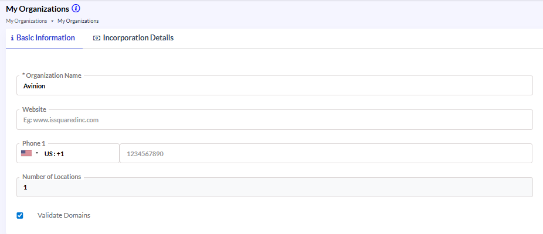{width=87%}

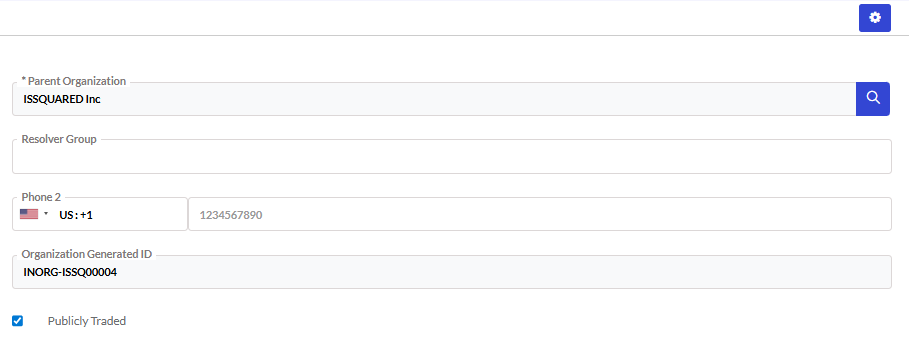{width=89%}

### Settings Features

The Settings options in Edit Organization allow administrators to prepare and configure additional organization-related controls before or after saving the organization record.

**Key Settings Features**
- List Values
- Custom Fields
- Record Level Security
- Important Note
- Some Settings features become fully functional only after the organization record is saved successfully.
- Administrator Responsibilities
- Configure predefined dropdown values.
- Define additional organization fields
- Prepare security and access configurations
- Maintain organization-specific administrative settings.

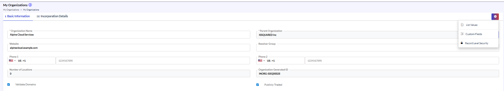{width=95%}

### List Values

The List Values option allows administrators to update and maintain predefined dropdown values associated with organization records.

- To modify existing list values:
- Open the Settings menu from the organization screen. Select List Values.
- Locate the required list category.
- Select the existing value to modify or click Add New to create additional values.
- Update the required information.
- Click Save / Update.

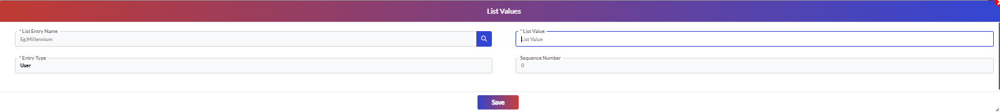{width=98%}

### Custom Fields

The Custom Fields option is used to manage additional organization fields and update existing field configurations.

To update custom fields for organizations:
- Open the Settings menu.
- Select Custom Fields.
- Locate the required custom field from the list.
- Click Edit to modify the field configuration.
- Update the required field details such as Label Name, Field Type, Options, or Section Assignment.
- Verify the updated configuration.
- Click Save.

### Record Level Security

The Record Level Security option allows administrators to manage organization access permissions for users and application roles.

- To update organization access permissions, open the Settings menu.
- Select Record Level Security.
- Navigate to the Roles or Users tab.
- Search and select the required role or user.
- Modify the required access permissions.
- Enable or disable View, Edit, Delete, or Grant Access permissions as required.
- Verify the permission configuration.
- Click Set Permissions / Save.

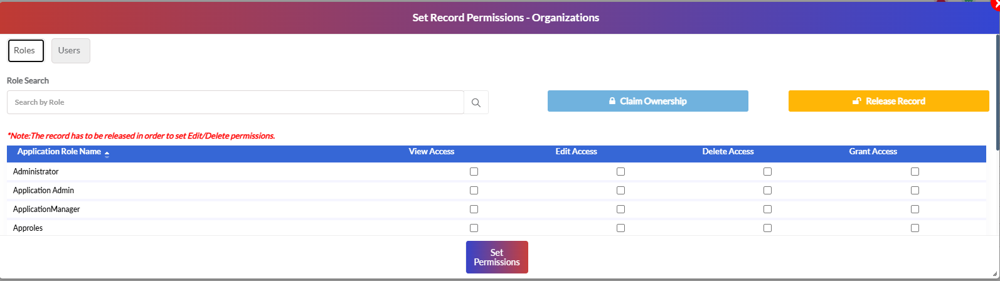{width=93%}

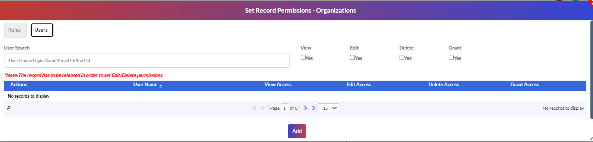{width=93%}

## Clone Organization

To duplicate an existing organization record:
- Select the required organization from the list.
- Click the Clone icon from the top toolbar.
- In the clone screen, modify the copied organization details as required.
- Verify the information before saving.
- Click Save / Create.

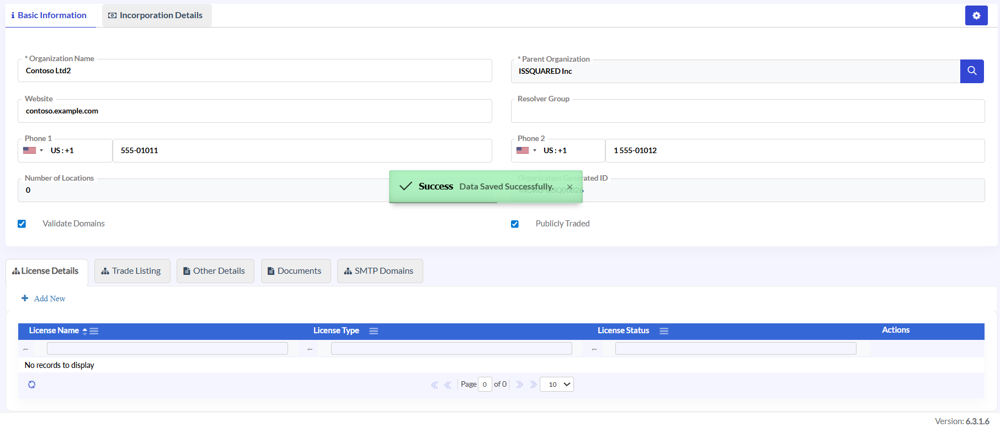{width=94%}

##  Delete Organization

To remove an organization record:
- Select the required organization from the list.
- Click the Delete icon from the top toolbar.
- In the confirmation message, verify the selected organization details.
- Click Confirm / Delete to permanently remove the organization.

{width=99%}

## View Organization

To view organization details, select the required organization record from the list.
- Click the View icon from the top toolbar. The system displays all configured information in read-only mode, including:
**Basic Information**
**Incorporation Details**
**License Details**
 - Trade Listing
**Other Details**
 - Documents
 - SMTP Domains
- Use the tabs to navigate between sections.

## Refresh Organization List

To reload the organization records displayed on the screen:
- Click the Refresh icon from the top toolbar.
- The system refreshes the organization list and displays the latest available records.

{width=99%}
