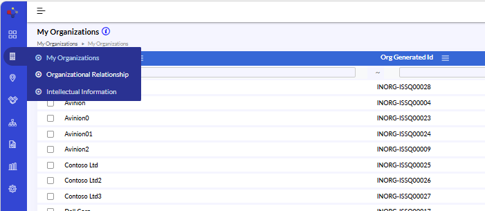
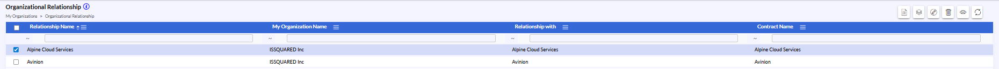

# Organization – Organizational Relationship

## Organization – Organizational Relationship

- This section is used to create and manage relationships between organizations such as customers, subsidiaries, vendors, partners, or service providers. It helps maintain business associations, contract relationships, and organizational hierarchy information.

{width=93%}

## Organizational Relationship – Edit/Modify Relationship Details

- Navigate to Organization > Organizational Relationship.
- Select the required relationship record from the list view.
- Open the selected record in edit mode.
- Update the required fields such as Relationship Type, Contract Information, Relationship Name, Relationship Description, or Notes.
- Verify the updated information for accuracy.
- Click Save / Update to apply the changes.

## Organizational Relationship – Common Toolbar Actions

- The Organizational Relationship section supports common toolbar actions similar to the My Organizations module.
- Clone – Creates a duplicate copy of the selected relationship record for quicker record creation.
- Delete – Removes the selected organizational relationship record from the system.
- View – Opens the selected relationship record in read-only mode for review purposes.
- Refresh – Reloads and displays the latest available records in the list view.

{width=98%}

{width=98%}
